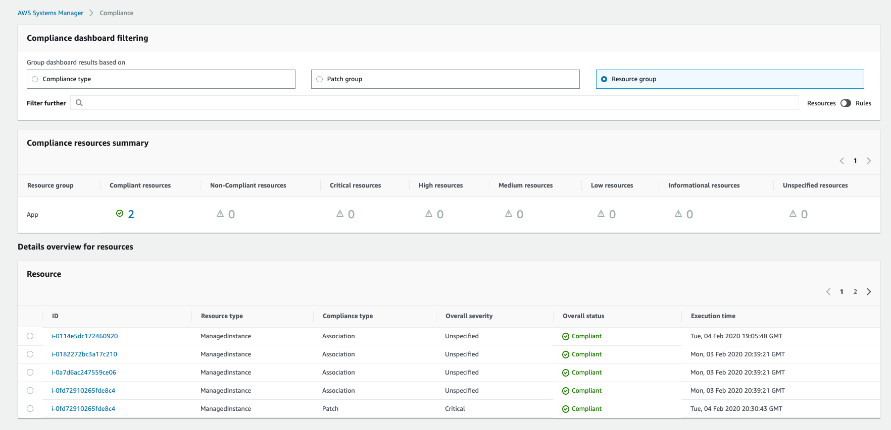

You can use AWS Systems Manager Configuration Compliance to scan your fleet of managed instances for patch compliance and configuration inconsistencies. You can collect and aggregate data from multiple AWS accounts and Regions, and then drill down into specific resources that aren’t compliant. By default, Configuration Compliance displays current compliance data about Systems Manager Patch Manager patching and Systems Manager State Manager associations. Systems Manager Compliance offers the following additional benefits and features:

* View compliance history and change tracking for Patch Manager patching data and State Manager associations by using AWS Config.

* Customize Systems Manager Compliance to create your own compliance types based on your IT or business requirements.

* Remediate issues by using Systems Manager Run Command, State Manager, or Amazon CloudWatch Events.

* Port data to Amazon Athena and Amazon QuickSight to generate fleet-wide reports.

Configuration Compliance is offered at no additional charge. You only pay for the AWS resources that you use.

1.  Navigate to [Systems Manager \> Instances & Nodes \>
    Compliance](https://console.aws.amazon.com/systems-manager/compliance)

2. Compliance will allow you to sort by Compliance Type, Patch Group,
    or Resource Group

3. Sort by **Resource Group**

4. You can now review the compliance status of the **Resource Group**
    we created earlier in the lab

5. If you have thousands of instances this view can get overwhelming --
    You can further drill down the results by using the **Filter Further** search bar

6. Any time you see an item for **Compliance** within a dashboard, this
    is where you can influence how that information is displayed within
    this dashboard (Critical, high, medium, and low)
