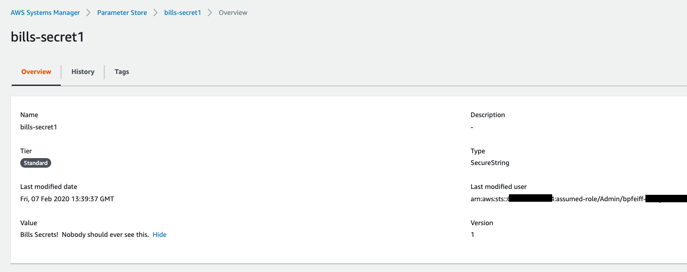
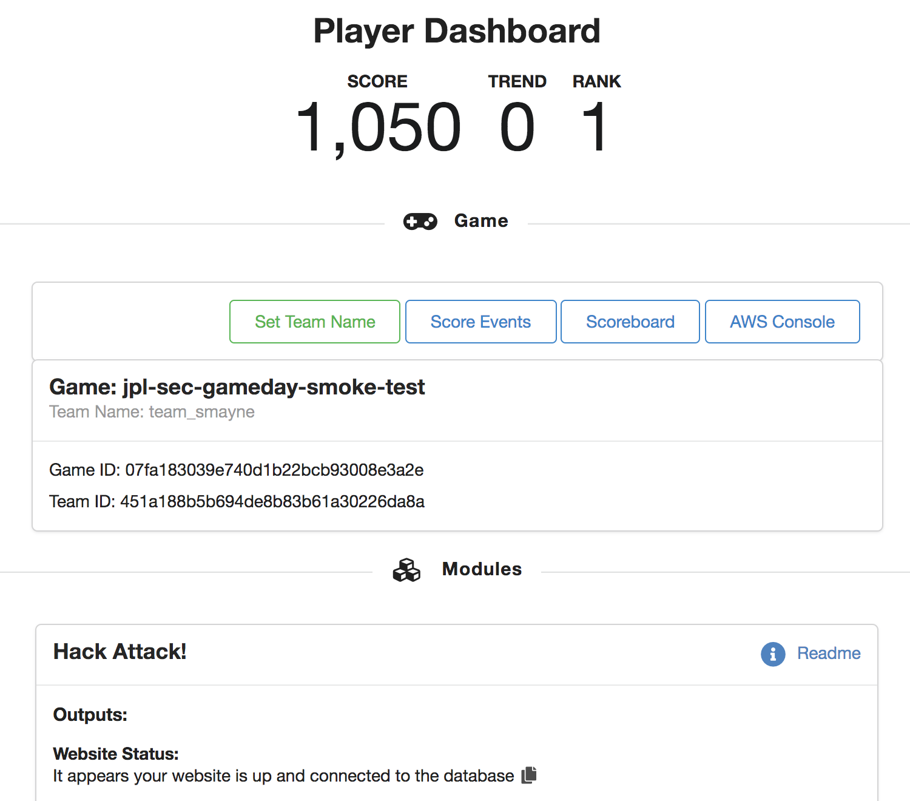
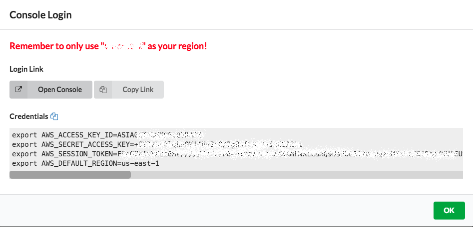
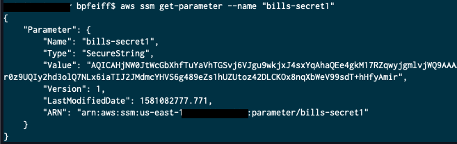
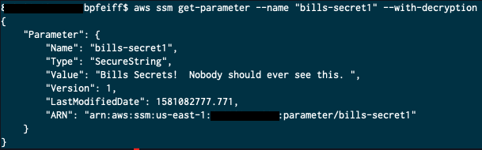
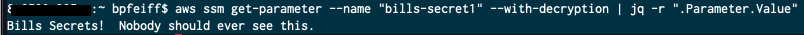

AWS Systems Manager Parameter Store provides secure, hierarchical storage for configuration data management and secrets management. You can store data such as passwords, database strings, Amazon Machine Image (AMI) IDs, and license codes as parameter values. You can store values as plain text or encrypted data. You can reference Systems Manager parameters in your scripts, commands, SSM documents, and configuration and automation workflows by using the unique name that you specified when you created the parameter.

[Supported Services](https://docs.aws.amazon.com/systems-manager/latest/userguide/systems-manager-parameter-store.html)

In this section you will create a Secure String parameter and retrieve it using the Console and CLI. 

1.  Navigate to [Systems Manager \> Application Management \> Parameter
    Store](https://console.aws.amazon.com/systems-manager/parameters)

1. Fill out the data for adding your secret

1. **Name:** ```YOURNAME-secret1```

1. **Description:** blank

1. **Tier:** Standard

1. **Type:** SecureString

1. **KMS Key Source:** My current account (uses the default KMS
    key or specify a CMK of your choice)

1. **KMS Key ID:** alias/aws/ssm (AWS managed key for Systems
    Manager)

1. **Value:** This is your secret data whether that is configuration
    data, passwords, connection strings, etc...

1. **Tags:** your choice -- this is ideal to organize your secrets so you do not get lost --
    - Key: Team / Value: ```Operations```
    - Key: Application / Value: ```RevenueGen1```
    - Key: Owner / Value: ```YOURNAME```

1. Select **Create Parameter**

1. You are brought back to the **Parameter Store** home screen and now
    select your new secret

1. You can Select **Show** to reveal the contents of the secret



1. History will show you the users who created, updated, or deleted the
    secret

1. Versions of the parameter are kept but if you delete the parameter
    then the history is deleted as well

### Retrieve Secret from CLI \[Optional\]

Most use cases you would not be using the Management Console to retrieve
your secrets. You would be using the CLI or SDK to programmatically
gather this information as part of the task you are performing. Below is
a basic exercise to gather the secret you made previously.

1.  Navigate back to <https://dashboard.eventengine.run>

1. Pull up the credentials from the Event Engine Dashboard

 

Select **AWS Console**



Gather your access keys

1. Install AWS CLI -
    <https://docs.aws.amazon.com/cli/latest/userguide/install-cliv2.html>

1. Once installed run aws configure and use the access keys above. Set region to ```us-east-1```

1. We made our secret a SecureString -- When we run aws ssm
    get-parameter without the decryption flag you can see the value of
    the parameter is obscured

1. Command: aws ssm get-parameter \--name "YOURNAME-secret1"

 

1. Now we add the with decryption flag

1. Command: aws ssm get-parameter \--name \"YOURNAME-secret1\"
    \--with-decryption



1. You can see that the value is now in plain text

1. Then you would parse the JSON output with something like jq to be
    able to get the raw value

1. Command: aws ssm get-parameter \--name \"YOURNAME-secret1\"
    \--with-decryption \| jq -r \".Parameter.Value\"


