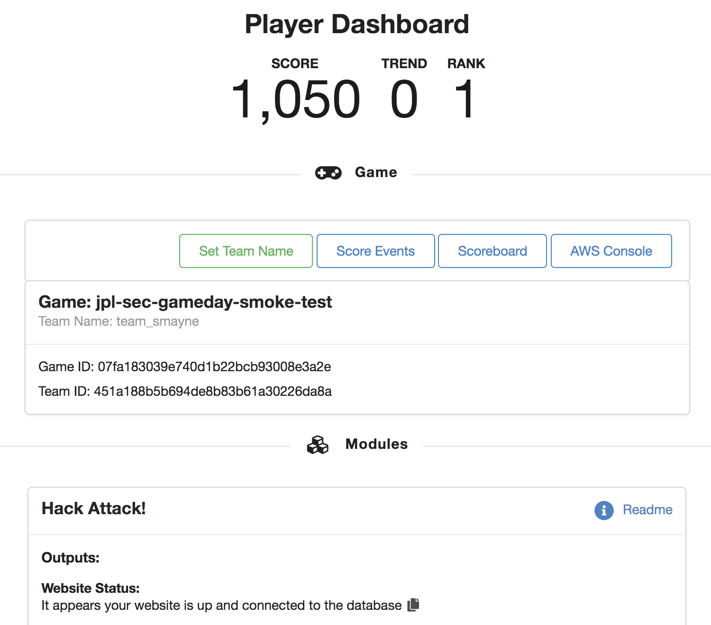
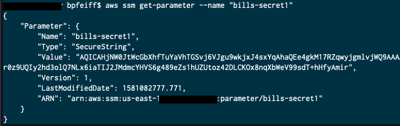

Compliance is intended to be a dashboard where you can influence what is
important to you and your organization by specifying a Severity level
during configuration and present on if it is compliant with the task.
For example, you might have an Association that you want to know is
being applied to your instance (host firewall configuration). Another
example would be if your instances have been patched according to the
configured Patch Baseline.

1.  Navigate to [Systems Manager \> Instances & Nodes \>
    Compliance](https://console.aws.amazon.com/systems-manager/compliance)

```{=html}
<!-- -->
```
49. Compliance will allow you to sort by Compliance Type, Patch Group,
    or Resource Group

50. Sort by Resource Group

51. You can now review the compliance status of the **Resource Group**
    we created earlier in the lab

52. 

53. If you have thousands of instances this view can get overwhelming --
    You can further drill down the results by using the **Filter
    Further** search bar

54. 

55. Any time you see an item for **Compliance** within a dashboard, this
    is where you can influence how that information is displayed within
    this dashboard (Critical, high, medium, and low)

Parameter Store
---------------

Parameter Store is a secure location to keep secrets and configuration
information. It allows you to dynamically and securely retrieve data as
you need it vs saving it within the Operating System or configuration
files.

1.  Navigate to [Systems Manager \> Application Management \> Parameter
    Store](https://console.aws.amazon.com/systems-manager/parameters)

```{=html}
<!-- -->
```
56. Fill out the data for adding your secret

57. **Name** **=** YOURNAME-secret1

58. **Description** **=** blank

59. **Tier** **=** Standard

60. **Type** **=** SecureString

61. **KMS Key Source** **=** My current account (uses the default KMS
    key or specify a CMK of your choice)

62. **KMS Key ID** **=** alias/aws/ssm (AWS managed key for Systems
    Manager)

63. **Value =** This is your secret data whether that is configuration
    data, passwords, connection strings, etc...

64. **Tags =** your choice -- this is ideal to organize your secrets so
    you do not get lost --

    a.  Key=Team / Value=Operations

    b.  Key=Application / Value=RevenueGen1

    c.  Key=Owner / YOURNAME

65. Select **Create Parameter**

66. You are brought back to the **Parameter Store** home screen and now
    select your new secret

67. You can Select **Show** to reveal the contents of the secret

    a.  

68. History will show you the users who created, updated, or deleted the
    secret

69. Versions of the parameter are kept but if you delete the parameter
    then the history is deleted as well

### Retrieve Secret from CLI \[Optional\]

Most use cases you would not be using the Management Console to retrieve
your secrets. You would be using the CLI or SDK to programmatically
gather this information as part of the task you are performing. Below is
a basic exercise to gather the secret you made previously.

1.  Navigate back to <https://dashboard.eventengine.run>

```{=html}
<!-- -->
```
70. Pull up the credentials from Dashboard

    a.  {width="1.4572801837270342in"
        height="1.2824070428696412in"}Select **AWS Console**

    b.  {width="3.52129593175853in"
        height="1.695553368328959in"}Gather your access keys

71. Install AWS CLI -
    <https://docs.aws.amazon.com/cli/latest/userguide/install-cliv2.html>

72. Once installed run aws configure and use the access keys above --
    region = us-east-1

73. We made our secret a SecureString -- When we run aws ssm
    get-parameter without the decryption flag you can see the value of
    the parameter is obscured

74. Command = aws ssm get-parameter \--name "YOURNAME-secret1"

    a.  

75. Now we add the with decryption flag

76. Command = aws ssm get-parameter \--name \"bills-secret1\"
    \--with-decryption

    a.  

77. You can see that the value is now in plain text

78. Then you would parse the JSON output with something like jq to be
    able to get the raw value

79. Command = aws ssm get-parameter \--name \"bills-secret1\"
    \--with-decryption \| jq -r \".Parameter.Value\"

    a.  
