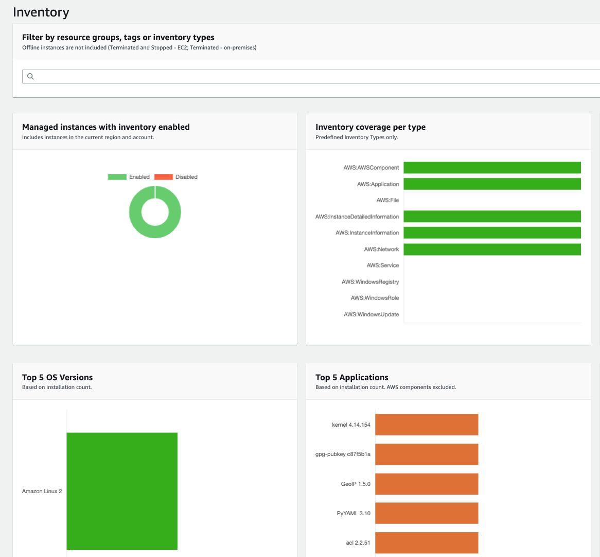
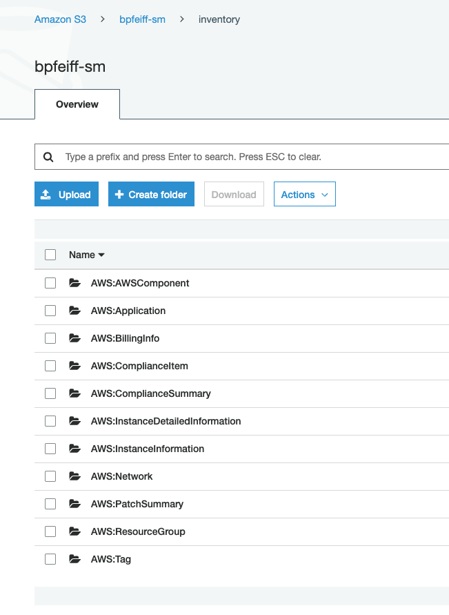
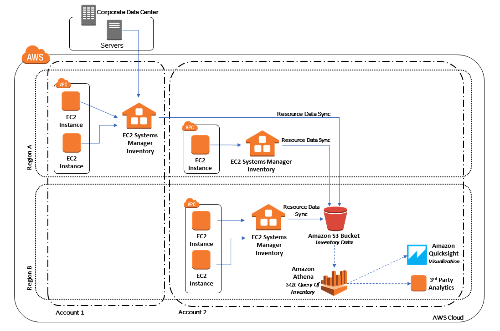

Inventory allows you to collect a software catalog and configuration
information for your instances. It leverages **State Manager** to create
an association that runs the pre-defined document
AWS-GatherSoftwareInventory on an interval that you specify. You can
further extend the functionality of inventory by enabling a **Resource
Data Sync**. This functionality Resource data sync lets you sync
inventory data to Amazon S3. You can sync inventory data collected from
multiple AWS accounts or regions to a single S3 bucket, thus enabling a
single view of inventory data across AWS accounts or regions.

1.  Navigate to [Systems Manager \> Instances & Nodes \>
    Inventory](https://console.aws.amazon.com/systems-manager/inventory)

2.  Under the Dashboard tab select **Setup Inventory**

3.  Inventory Association Configuration Details

    a.  **Name =** Keep default

    b.  **Targets =** Selecting all managed instances in this account (you
        can target this association if you don't want all instances
        included)

    c.  **Schedule =** Keep default (30 minutes)

    d.  **Parameters =** Keep all defaults

    e.  **Advanced =** Leave unchecked we will configure this separately

4.  Select **Setup Inventory**

5.  Select **View Details** (top right inside the green success banner
    -- If not, go to State Manager and drill into the details of the
    **Association** named **Inventory-Association**

6.  Navigate back to the **Inventory** landing page

    a.  You can now see data is being populated into the Dashboard



7.  Select **Detailed View** tab on the **Inventory** landing page

8.  Make an S3 bucket before creating the **Resource Data Sync**

    a.  **NOTE:** If you did the Distributor Lab and created a bucket
        for **Systems Manager** usage then just use that and create an
        Inventory prefix so your data remains organized

    b.  Navigate to [S3](https://s3.console.aws.amazon.com/s3)

    c.  Select **Create Bucket**

    d.  Enter something like -- YOURFIRSTNAME10-sm

    e.  **Region =** us-east (N. Virginia)

    f.  Keep all defaults

    g.  Block all public access

    h.  Create Bucket

    i.  Go to the **Permissions** tab

    j.  Go to Bucket policy

    k.  Enter in your Bucket Name and select save

```
{

    "Version": "2012-10-17",

    "Statement": [

        {

            "Sid": "SSMBucketPermissionsCheck",

            "Effect": "Allow",

            "Principal": {

                "Service": "ssm.amazonaws.com"

            },

            "Action": "s3:GetBucketAcl",

            "Resource": "arn:aws:s3:::ENTERYOURBUCKET"

        },

        {

            "Sid": " SSMBucketDelivery",

            "Effect": "Allow",

            "Principal": {

                "Service": "ssm.amazonaws.com"

            },

            "Action": "s3:PutObject",

            "Resource": [

                "arn:aws:s3:::ENTERYOURBUCKET/inventory/*"

            ],

            "Condition": {

                "StringEquals": {

                    "s3:x-amz-acl": "bucket-owner-full-control"

                }

            }

        }

    ]

}
```

9.  Navigate back to [Inventory \> Resource Data
    Sync](https://console.aws.amazon.com/systems-manager/managed-instances/resource-data-sync)

10. Select Create resource data sync

11. Configuration details

    a.  Sync name = YOURNAME-inventory-s3-sync

    b.  Bucket name = the name of the bucket your created previously

    c.  Bucket prefix = inventory

    d.  Bucket region = us-east-1

    e.  KMS key = leave blank for the purpose of the demo

    f.  Select **Create**

12. Switch back to your bucket and you can now see the data being synced

    a.  

    b.  Now we have a clean data structure for inventory data

    c.  From here you can utilize Athena and Quicksight to gain deeper
        insight about the inventory data gathered

    d.  Tutorial here =
        <https://docs.aws.amazon.com/systems-manager/latest/userguide/sysman-inventory-datasync.html>

