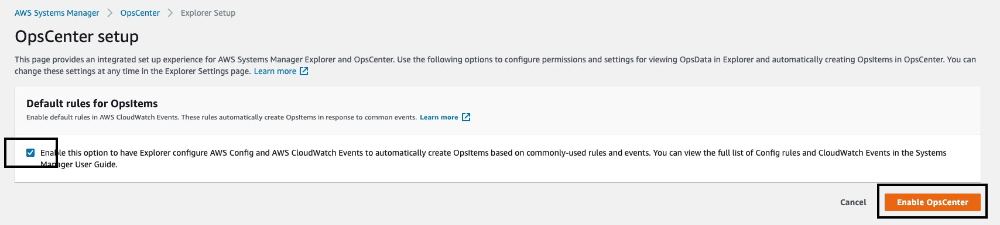
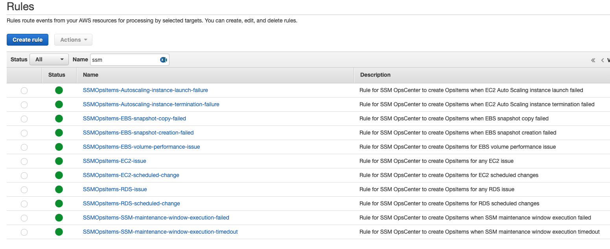
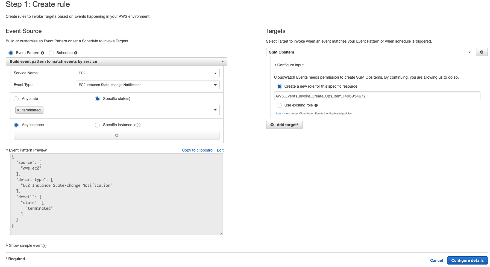
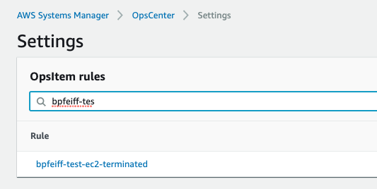
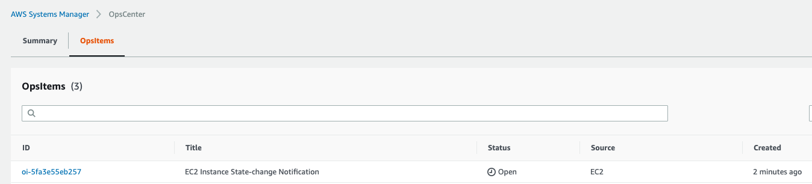
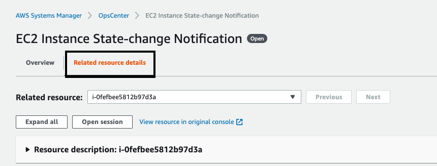
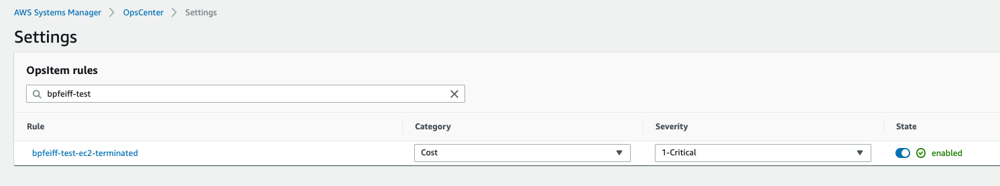

OpsCenter provides a central location where operations engineers and IT professionals can view, investigate, and resolve operational work items (OpsItems) related to AWS resources. OpsCenter is designed to reduce mean time to resolution for issues impacting AWS resources. This Systems Manager capability aggregates and standardizes OpsItems across services while providing contextual investigation data about each OpsItem, related OpsItems, and related resources. OpsCenter also provides Systems Manager Automation documents (runbooks) that you can use to quickly resolve issues. You can specify searchable, custom data for each OpsItem. You can also view automatically-generated summary reports about OpsItems by status and source.

OpsCenter is integrated with Amazon CloudWatch Events. This means you can create CloudWatch Events rules that automatically create OpsItems for any AWS service that publishes events to CloudWatch Events. For example, you can configure SSM OpsItems as the target for the following types of events, and hundreds more:

* Security issues, such as alerts from AWS Security Hub

* Performance issues, such as a throttling event for Amazon DynamoDB or degraded Amazon Elastic Block Store (EBS) volume performance

* Failures, such as an Amazon EC2 Auto Scaling group failure to launch an instance or a Systems Manager Automation execution failure

* Health alerts, such as an AWS Health alert for scheduled maintenance

* State changes, such as an EC2 instance state change from Running to Stopped

In this lab we will enable OpsCenter, create a new OpsItem, trigger the OpsItem, and review the output within OpsCenter.  

1.  Navigate to [Systems Manager \> Operations Management \>
    OpsCenter](https://console.aws.amazon.com/systems-manager/opsitems)

1.  Select **Get started**

1.  Leave the Default Rules item checked

1.  Select **Enable OpsCenter**

    

    - When selecting **Default rules for OpsItems** multiple CloudWatch Events Rules are [automatically created](https://docs.aws.amazon.com/systems-manager/latest/userguide/Explorer-setup-default-rules.html)

    

1.  Let's create an OpsItem / Rule so you can see the power of OpsCenter
    and its ability to aggregate data across AWS services

    -  Navigate to [CloudWatch \> Events \>
        Rules](https://console.aws.amazon.com/cloudwatch/home?region=us-east-1#rules:)

    - Choose **Create Rule**

    - For **Event Source** select **Event Pattern**

    - For **Service Name** select **EC2**

    - For **Event Type** select **EC2 Instance State-change Notification**

    - For **Specific States** select **Terminated**

    - Choose **Any instance**

    - For **Target** select **SSM OpsItem**

    - For **Role** Allow create new role

        - Alternatively, you could create an **IAM Role** with the following permissions / policy

                <details>
                <summary>Click to expand for the policy details!</summary>
                <p>

                ```json
                {
                    "Version": "2012-10-17",
                    "Statement": [
                        {
                            "Effect": "Allow",
                            "Action": [
                                "ssm:CreateOpsItem"
                            ],
                            "Resource": [
                                "*"
                            ]
                        }
                    ]
                }
                ```

                </p>
                </details>

    - Select **Configure Details**

    - For **Name** enter YOURNAME-test-ec2-terminated

    - For **State** select **Enabled**

    - Choose **Create Rule**

    

1.  Navigate Back to [Systems Manager \> Operations Management \>
    OpsCenter \> OpsItems \> Configure
    Sources](https://console.aws.amazon.com/systems-manager/explorer/settings?region=us-east-1&source=opscenter)

    - You will now see the new CW rule we created



- Navigate to [EC2](https://console.aws.amazon.com/ec2/v2/home?region=us-east-1#Instances:sort=tag:Name)

1.  Select **Web2** and terminate it

    a.  Highlight instance **\> Actions \> Instance State \> Terminate**

1.  Navigate to
    [OpsCenter](https://console.aws.amazon.com/systems-manager/opsitems/?region=us-east-1#activeTab=REPORTING)

1.  You will now see OpsItems by Source and age -- Grouped by source:
    EC2

    -  Under **count** select the number or go to OpsItem status summary and select one of the open items

    

    -  You will now see our event -- Select the ID (e.g.
        oi-\#\#\#\#\#\#\#\#\#\#\#\#)

    -  You will see data regarding the event (aggregated sources)

        -  Related resources shows the ARN of the instance your
            terminated

        - Runbooks is powerful as it allows you to take action on the event to aid in remediation

        - Operational Data will show you the instance ID, the state, and the CloudWatch Event that generated it

    -  Go back to **Related resource details** (top left)

        

        - **Resource description** shows you an output of the meta
            data that is displayed in the EC2 console when the instance
            is running

        - Tags for the instance are shown

        - Details from Config (might take some time to show up in
            Opsitems)

        -  CloudTrail is powerful as it shows you relevant events about
            what happened (who stopped the instance and when) - **NOTE:** This may take some time to populate in the console after the event occurs

        - CloudFormation stack resources shows the relevant stack data

.  The last item to cover is under OpsItems \> Configure Sources is change the Severity it is
    alerted as (think of the compliance dashboard we did before), Category of the event, and the state

    

1.  OpsCenter is complimentary to other
    tools like CWE, Config, and SNS notifications as it allows you to
    easily respond to events with SSM automation runbooks (think create
    a ServiceNow Incident after am event)

**Tutorial:**

<https://www.youtube.com/watch?v=r6ilQdxLcqY>

This covers much of the same material as above but allows you to listen to the instructor and learn at your own pace.
