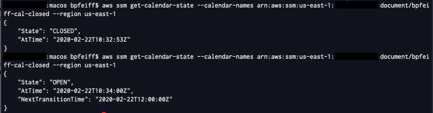

Change Calendar is a powerful tool that allows you to specify whether
changes can be executed during a specific date and time automatically.
You can query this information using Automation workflows by
incorporating them into your Automation Document or you can query the
calendar state from AWS CLI.

1.  Navigate to [Systems Manager \> Actions & Change \> Change
    Calendar](https://console.aws.amazon.com/systems-manager/change-calendar/)

2.  Select **Create change calendar**

3.  Enter a name -- YOURNAME-cal-closed

    a.  Description is optional but would make sense to add additional
        meta data especially in complex environments

4.  Calendar type = **Closed by Default**

5.  Select the Calendar name to view the details of the calendar (or
    highlight the radio button and select edit)

6.  Under Events (top left corner) you will see the calendar view and
    the current month and day highlighted with a blue dot and Select
    **Create Event** (top right corner)

7.  Name = yourname-NOCHANGES

8.  Set the start date as the current day and time and make it last for
    2 hours -- Ensure that the calendar time zone is set to your current
    time zone

    a.  NOTE: You can also set reoccurrence which would be a powerful
        tool / use for regular events like application releases or
        change windows

9.  The event now shows up on your calendar in light blue on the day you
    specified

10. Go to details (top left corner -- middle)

11. You will now see calendar use which shows you the CLI commands and
    the content that you would add to your Automation Documents to check
    the calendar if the change is allowed or blocked

12. You will now take this information and you can query the calendar
    from the CLI

        aws ssm get-calendar-state \--calendar-names
        arn:aws:ssm:us-east-1:YOURACCOUNTNUMBER:document/YOURCALENDARNAME
        \--region us-east-1

13. You will see below 2 states -- One where the change time on a closed
    by default calendar is wrong (incorrect time zone) and is blocking
    changes and also one where the correct time zone is configured and
    the calendar is open for the specified period

    

14. One thing to note is that your IAM role / user will need to have the
    appropriate permissions added to the assigned policy to get the
    calendar state

    **ssm:GetCalendarState**