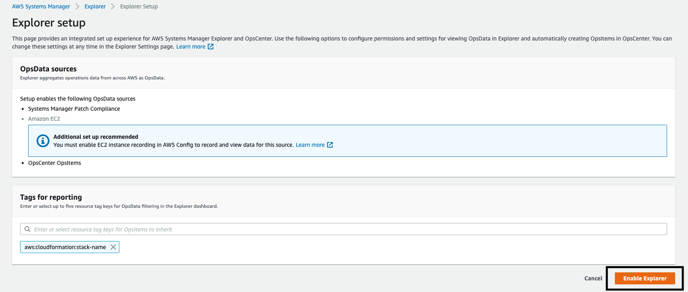
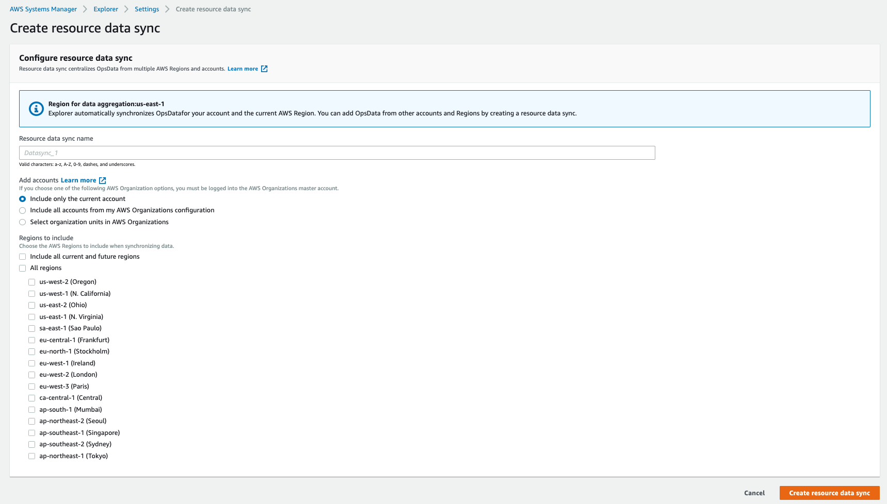

AWS Systems Manager Explorer is a customizable operations dashboard that reports information about your AWS resources. Explorer displays an aggregated view of operations data (OpsData) for your AWS accounts and across Regions. In Explorer, OpsData includes metadata about your EC2 instances, patch compliance details, and operational work items (OpsItems). Explorer provides context about how OpsItems are distributed across your business units or applications, how they trend over time, and how they vary by category. You can group and filter information in Explorer to focus on items that are relevant to you and that require action. When you identify high priority issues, you can use Systems Manager OpsCenter to run Automation runbooks and quickly resolve those issues.

[Getting Started with Explorer](https://docs.aws.amazon.com/systems-manager/latest/userguide/Explorer.html)

In this lab we will enable Explorer and review the options for multi-region multi-account deployment.  

1.  Navigate to [Systems Manager \> Operations Management \>
    Explorer](https://console.aws.amazon.com/systems-manager/explorer?region=us-east-1)

2.  Select **Get started**

3.  For tags for reporting -- remove the cloudformation default key (we
    can configure these later on) and select **Enable Explorer**

4.  You are presented with an option to configure resource data sync --
    Since we are in the lab and using a single account / single region
    this won't be necessary but worth visualizing

    a.  This makes it easy to select:

        i.  Select regions you are active in

        ii. Select all accounts in an org

        iii. EVEN COOLER select OUs within an org

5.  Select **Settings** (top right) \> Under Tags for Reporting \> We
    can enter Patch Group and SSM Managed and then select **Save**