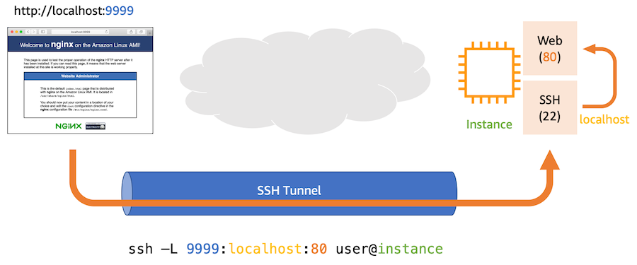
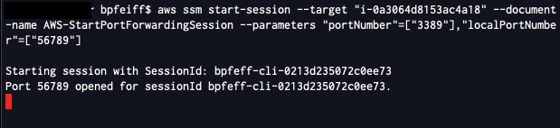
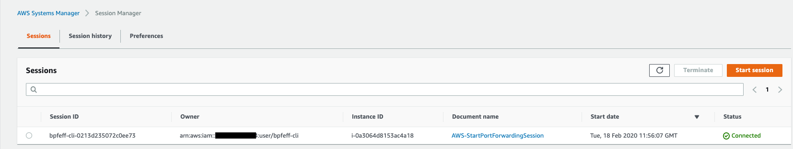
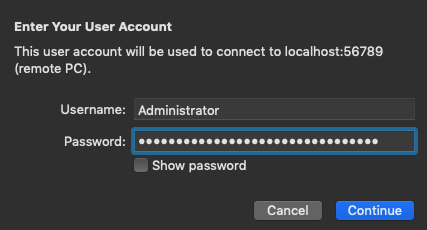

One common thing that is mentioned when showing **Session Manager** to
folks new to **Systems Manager** is that it doesn't address RDP
sessions. Port Forwarding utilizes SSH tunneling to establish a secure
tunnel between localhost and a remote service.



This command tells SSH to connect to instance as user ec2-user, open
**port 9999** on my local laptop, and forward everything from there
to **localhost:80** on the instance. When the tunnel is established, I
can point my browser at **http://localhost:9999** to connect to my
private web server on **port 80.** This lab will demonstrate how to
connect to a Windows instance via Remote Desktop Protocol via **Port
Forwarding with Session Manager**.

In this lab you will deploy a new Managed Instance

### Deploy Windows Instance
1. Open the Amazon EC2 console at https://console.aws.amazon.com/ec2.
1. In the navigation pane, select **Instances**.
1. Choose **Launch Instance**.
    - On the **Step 1: Choose an Amazon Machine Image (AMI)** page, select **Microsoft Windows Server 2019 Base**.
    - On the **Step 2: Choose an Instance Type** page, select **t2.small**, and choose **Next: Configure Instance Details**.
    - On the **Step 3: Configure Instance Details** page, perform the following steps:
        - For **Number of instances**, enter ```1```.
        - For **Auto-assign Public IP**, ensure auto-assign public IP is enabled.
        - For **IAM Role**, select the IAM role previously created, **SM-Workshop-ManagedInstancesRole**. This is what allows instances to be managed by Systems Manager.
        - Choose **Next: Add Storage**.
    - Leave the defaults and choose **Next: Add Tags**.
        - Do not add tags as we will create some later in the workshop.
    - Choose **Next: Configure Security Group**.
    - On the **Step 6: Configure Security Group** page, choose **Select an existing security group** and then select the Security Group named **default** with the description **default VPC security group**.
    - Choose **Review and Launch**.
    - Choose **Launch**.
    - Choose **Proceed without a key pair** from the drop-down menu and select the box for **I acknowledge that I will not be able to connect to this instance unless I already know the password built into this AMI.**
        - We do not need to launch our EC2 instances with key pairs as we can remotely connect later in the workshop using Session Manager.
    - Choose **Launch Instances**.

1.  Go back to view instances and ensure that all transition to an
    Instance State of running

1.  Navigate to [Systems Manager \> Instances & Nodes \> Managed
    Instances](https://console.aws.amazon.com/systems-manager/managed-instances)

1.  Ensure that the new instance is listed (if not check your IAM role
    attached to the instance)

1.  Grab the instance ID as you will need this for the next section

### Establish CLI Session

1.  Open an AWS CLI session (refer to Accessing AWS Account for your AWS
    keys)

1. Install the [Session Manager Plugin](https://docs.aws.amazon.com/systems-manager/latest/userguide/session-manager-working-with-install-plugin.html)

1.  Run the following command:

    ```
    aws ssm start-session \--target \"Your Instance ID\"
        \--document-name AWS-StartPortForwardingSession \--parameters
        \"portNumber\"=\[\"3389\"\],\"localPortNumber\"=\[\"56789\"\]
    ```

1.  You will see that your session has started



1.  Navigate to [Systems Manager \> Instances & Nodes \> Session
    Manager](https://console.aws.amazon.com/systems-manager/session-manager/sessions)

1.  You will now see your session open inside the console



1.  Navigate back EC2 and get your password

    a.  Select **Connect** on your instance

    b.  Select **Get password**

    c.  Select your Key Pair used to deploy the instance

1.  Open your RDP client

1.  Connect to localhost:56789



1.  Log in with your Administrator user and password

    a.  If you switch back to your console you will see the latest
        message is "Connection accepted for session -- Meaning you
        established a connection with the remote service on the defined
        local port in your command

1. Wait for login -- t2.micro (t2.small is what should have been used)
    is a bit undersized for Windows Server 2019 and took a while to log
    in

1. Once logged in you can query the instance meta-data to verify you
    are on the right instance -- Open Powershell console

   -   **Invoke-RestMethod -uri http://169.254.169.254/latest/meta-data/public-hostname**

   - **Invoke-RestMethod -uri http://169.254.169.254/latest/meta-data/instance-id**

2. Got back to your AWS CLI session and kill the command -- You will
    see the RDP session terminate as the tunnel is torn down

3. Navigate back to Session Manager \> Session History and you can see

   - Session owner ARN

   - Instance ID that was connected to

   - Start and end date and time of session