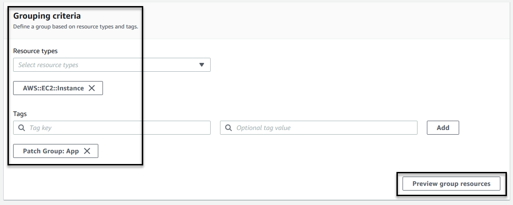

You can use resource groups to organize your AWS resources. Resource groups make it easier to manage, monitor, and automate tasks on large numbers of resources at one time.

AWS Resource Groups provides two general methods for defining a resource group. Both methods involve using a query to identify the members for a group.

The first method relies on tags applied to AWS resources to add resources to a group. Using this method, you apply the same key/value pair tags to resources of various types in your account and then use the AWS Resource Groups service to create a group based on that tag pair.

The second method is based on resources available in an individual AWS CloudFormation stack. Using this method, you choose an AWS CloudFormation stack, and then choose resource types in the stack that you want to be in the group.

You can specify a resource group as the target for the following Systems Manager capabilities:

* A command you run in Run Command.

* An Automation workflow you run in Automation.

* An association you create in State Manager.

* A maintenance window you create in Maintenance Windows.

* A package installation or update operation in Distributor.

This section will cover creating a Resource Group and some tags that will be used later on in the Patch Manager lab.  

Getting Started

1.  Navigate to the Systems Manager Console \> Application Management \>
    [Resource
    Groups](https://console.aws.amazon.com/systems-manager/resource-groups)

2.  Create a resource group (on the right)

3.  From navigation panel on the left, under **Tagging** select **Tag
    Editor**

    a.  **Region:** us-east-1

    b.  **Resource types:** AWS::EC2::Instance

    c.  Select **Search resources**

    d.  Select the 2 instances with Key:Name of Value:App1 & App2 from the
        4 instances \> Select **Manage Tags of selected
        resources**

    e.  Add tag

        i.  Key: Patch Group

        ii. Value: App

    f.  Select **Review and apply tag changes**

4.  From navigation panel on the left, under **Resources** select
    **Create Resource Group**

    a.  Select **Tag based**

    b.  Under Resource Types select **AWS::EC2::Instance**

    c.  Under Tags enter

        i.  Key: Patch Group

        ii. Value: App

    d.  Select **View Group Resources**

5.  In the group name enter **App**

6.  In group tags you can add more tags to the full group if you would
    like -- Key: App / Value: Front-end

    a.  These group tags do not show up under the individual resources
        -- It is another layer of tagging that can be done to the
        Resource Group

7.  Select **Create Group**

8.  Repeat the above steps for the remaining 2 Instances but tag them as
    **Web**
