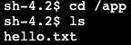
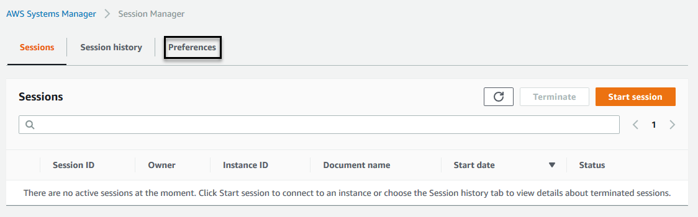

Session Manager is a fully managed AWS Systems Manager capability that lets you manage your EC2 instances, on-premises instances, and virtual machines (VMs) through an interactive one-click browser-based shell or through the AWS CLI. Session Manager provides secure and auditable instance management without the need to open inbound ports, maintain bastion hosts, or manage SSH keys. Session Manager also makes it easy to comply with corporate policies that require controlled access to instances, strict security practices, and fully auditable logs with instance access details, while still providing end users with simple one-click cross-platform access to your managed instances.

In order to establish a session, the IAM user or role must have Session Manager permissions as well as access to the target managed instances. At minimum, SSM Agent version 2.3.68.0 or later must be installed on the instances you want to connect to through sessions.

**About the ssm-user account**
Starting with version 2.3.50.0 of SSM Agent, the agent creates a local user account called ```ssm-user``` and adds it to ```/etc/sudoers``` (Linux) or to the Administrators group (Windows). On agent versions before 2.3.612.0, the account is created the first time SSM Agent starts or restarts after installation. On version 2.3.612.0 and later, the ssm-user account is created the first time a session is started on an instance. This ```ssm-user``` is the default OS user when a Session Manager session is started.

    **Note**: If you want to prevent Session Manager users from running administrative commands on an instance, you can update the ssm-user account permissions. You can also restore these permissions after they have been removed. For more information, see [Step 7: (Optional) disable or enable ssm-user account administrative permissions](https://docs.aws.amazon.com/systems-manager/latest/userguide/session-manager-getting-started-ssm-user-permissions.html).

**ssm-user on Windows Server domain controllers**

Beginning with SSM Agent version 2.3.612.0, the ```ssm-user``` account is not created automatically on managed instances that are used as Windows Server domain controllers. To use Session Manager on a Windows Server machine being used as a domain controller, you must create the ```ssm-user``` account manually if it isn't already present. On Windows Server, SSM Agent sets a new password for the ```ssm-user``` account each time a session starts, so you do not need to specify a password when you create the account.

In this lab we will utilize Session Manager to connect to our Web instances that we ran our Command document against. 

1. Open the AWS Systems Manager console at https://console.aws.amazon.com/systems-manager/.
1. In the navigation pane, choose **Session Manager**.
1. Select **Start Session**.
1. Select one of the **Web** servers which we just targeted using Run Command.
1. Select **Start session**.
1. You will be directed to a new tab and presented with the shell of the target **Web** instance.
1. Switch back to the **Session Manager** console tab and select the refresh button.
    - In the **Sessions** section, you can now see the active session you've established.
1. Switch back to the tab with your active session and type following commands:
    ```
    pwd
    cd /
    cd app
    ls
    ```
    
    - You can see our text file ```hello.txt``` created by the Run Command document in the previous section.
    ```
    systemctl status httpd 
    ```
    - Apache is now running per our document instructions.
    

1. Select **Terminate** to close the session.
1. Go back to **Session Manager** and select refresh. You can see the session was ended and there are no running sessions.
1. Select the **Session History** tab.
1. You will see your previous session in a ```Terminating``` state. 

We will now configure session logging for CloudWatch Logs.

1. Open the Amazon CloudWatch console at https://console.aws.amazon.com/cloudwatch.
1. In the navigation pane, choose **Log Groups** in the **Logs** section.
1. Select **Create log group**.
    **Important:** Your role needs to have the appropriate [permissions within CloudWatch](https:/docs.aws.amazon.com/systems-manager/latest/userguide/session-manager-logging-auditing.html#session-manager-logging-auditing-cloudwatch-logs)
    - In this lab, the IAM role has the appropriate permissions so you do not need to make any modifications.
1. For **Log group name**, enter ```Systems-Manager-Workshop``` and choose **Create**.
1. Navigate back to the Session Manager console at https://console.aws.amazon.com/systems-manager/session-manager.
1. Select the **Preferences** tab.
    
1. Select **Edit**.
1. For **Send Session output to CloudWatch Logs**, select ```CloudWatch logs``` to enable writting session output to CloudWatch Logs.
    - Uncheck Encrypt log data for now. This can be optionally enabled in the CloudWatch (CW) Logs group console.
    - Select the log group we created above, ```Systems-Manager-Workshop```.
    - Select **Save**.

1. Now that we have enabled writting session output to CloudWatch Logs, repeat steps 4-8 to see the session output within CloudWatch Logs.
1. Select the **Session History** tab.
    - The most recent session will be in a ```Terminating``` state for 1-3 minutes as the history is sent to CloudWatch Logs for storage.
    - Periodically, select the refresh button to check on the status of the session.
1. Once the status is ```Terminated```, select the output location **CloudWatch Logs**.
1. In CloudWatch Logs you will see that inside your Systems Manager Log Group a new Log Stream was created and utilized the ID of the Session Manager session you just ended.
1. Expand the messages and you will see a full output of the terminal session.
    

This is powerful because now you have an easy interface to review session logs and you can also create metric filters and alarms based on specific log file entries (e.g. sudo). The alarms can then send messages to an SNS topic to alert or initiate automated workflows.