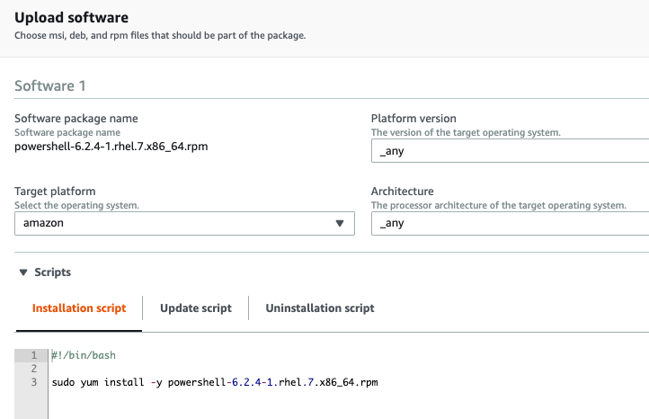
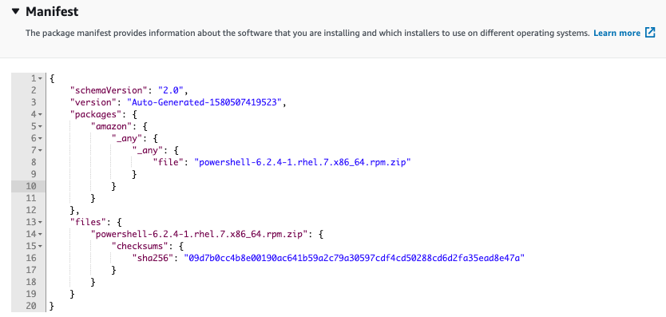

AWS Systems Manager Distributor lets you package your own software—and find AWS-provided agent software packages, such as AmazonCloudWatchAgent, or third-party packages such as Trend Micro—to install on AWS Systems Manager managed instances. Distributor publishes resources, such as software packages, to AWS Systems Manager managed instances. Publishing a package advertises specific versions of the package's document—a Systems Manager document that you create when you add the package in Distributor—to managed instances that you identify by managed instance IDs, AWS account IDs, tags, or an AWS Region.

After you create a package in Distributor, which creates an AWS Systems Manager document, you can install the package in one of the following ways:

* One time by using **AWS Systems Manager Run Command**

* On a schedule by using **AWS Systems Manager State Manager**

[Reference Video](https://www.youtube.com/watch?v=AvQWkfgEQI8)

1.  You will need to make an S3 bucket to store the package in:

    - Navigate to [S3](https://s3.console.aws.amazon.com/s3)

    - Select **Create Bucket**

    - For **Bucket Name** Enter: **YOURFIRSTNAME10-sm-distributor**

    - For **Region** ensure ```us-east-1``` is selected

    - For **Bucket settings for Block Public Access** ensure the check box is selected

    - **Keep all defaults** for the remaining items

    - Select **Create Bucket**

1.  Download the following package locally:

    [PowerShell v6.2.4](https://github.com/PowerShell/PowerShell/releases/download/v6.2.4/powershell-6.2.4-1.rhel.7.x86_64.rpm)

1.  Navigate to [Systems Manager \> Instances & Nodes \>
    Distributor](https://console.aws.amazon.com/systems-manager/distributor)

1.  Select **Create Package**

1.  Select **Simple Package** (Advanced allows you to specify your own
    install/uninstall scripts)

1.  Enter: **PowerShell-linux** for the name

1.  Select the bucket you made in the previous step

1.  Enter a prefix of **PowerShell-Linux**

1.  Select **Add Software** under Upload

    - Select the **PowerShell rpm** you downloaded in step 2

    - Set the **Target Platform** as ```amazon```

    - Set Platform Version as ```_any```

    - Set **Architecture** as ```_any```

1. If you expand **Scripts** you can see that distributor has already
        provided the appropriate installation / uninstallation scripts

    

1. If you expand **Manifest** you will see the package you are
    installing and the which package manager to use depending on the selected Operating Systems

    

1. Select **Create Package**

1. Your manifest file and package data will be uploaded to the
    specified S3 bucket

### Install Custom Package

Now that you have your custom package uploaded to your S3 bucket along
with the manifest. Distributor gives you 2 quick options to deploy your
package. You can either install on a schedule or install one time.
Installing on a schedule automatically prepares a **State Manager
Association** with the pre-defined **Document** of
**AWS-ConfigureAWSPackage** and the name of your custom package as a
parameter. Install one time does the same preparation but uses **Run
Command**.


