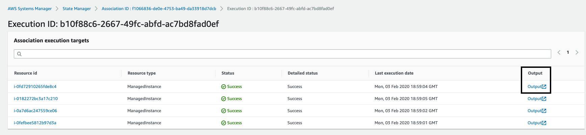
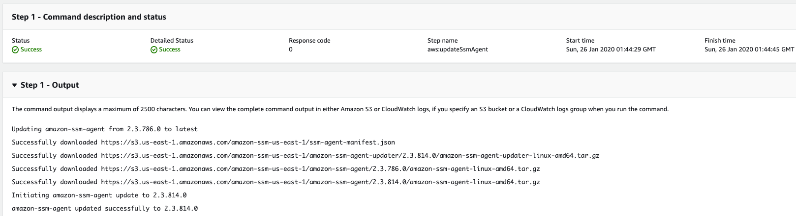

AWS Systems Manager State Manager is a secure and scalable configuration management service that automates the process of keeping your Amazon EC2 and hybrid infrastructure in a state that you define.

The following list describes the types of tasks you can perform with State Manager.

* Bootstrap instances with specific software at start-up

* Download and update agents on a defined schedule, including SSM Agent

* Configure network settings

* Join instances to a Windows domain (Windows Server instances only).

* Patch instances with software updates throughout their lifecycle

* Run scripts on Linux and Windows managed instances throughout their lifecycle

In this lab we will configure a **State Manager Association** that will update the Systems Manager Agent on the registered Managed Instances.  

1.  Navigate to [Systems Manager \> Instances & Nodes \> State
    Manager](https://console.aws.amazon.com/systems-manager/state-manager)

1. Select Create Association (top right)

    - For **Name** use UpdateSSMAgent

    - For **Document** search for **AWS-UpdateSSMAgent** for the Association

    - For **Parameters** leave as the Default

    - For **Targets** select all **Choose all instances**

    - For **Specify schedule** select **On schedule** and chose **CRON schedule builder** and have the **Association** run every 30 minutes

      - If this was a real world scenario you would configure the frequency to be 14 days per Systems Manager best practices

    - For **Advanced Options > Compliance** select High

      - This is specifying how you like this ranked within the Compliance
        dashboard -- if the agent is not updated you will see a High
        severity non-compliance alert

    - For **Rate Control** select **Target** to 1 and **Error** to 1

    - Leave writing output to S3 bucket unchecked for now

1. Select **Create Association**

1. Select the radio button next to the newly created **Association** 

1. Then Select **Apply Association Now** (upper right corner)

1. Chose **Apply**

1. Select radio button next to the **Association ID** to review the **Association details**

1. Select **Execution History**

1.  Select the most recent **Execution ID**

1. Select the **Output** of one of the Resource IDs

1. A new tab will open -- Expand **Step 1 -- Output**

1. You can see that output of the **Document** being executed and
    updating the SSM Agent

1. If there are no updates the installation is skipped
