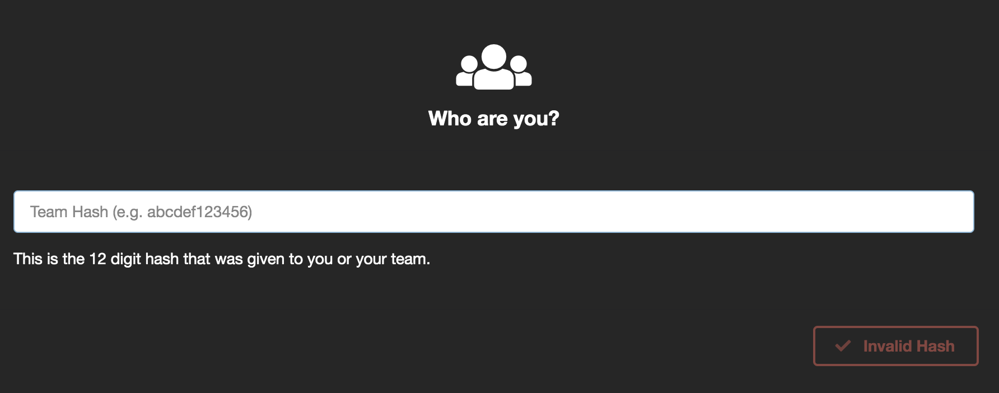

# AWS Systems Manager Workshop Introduction

This workshop is intended to provide a 200-300 level hands on experience with core AWS Systems Manager capabilities. Lets start with a brief overview of AWS Systems Manager capabilities: 

1.	**Resource Groups** - Group AWS resources together by any purpose or activity you choose, such as application, environment, region, project, campaign, business unit, or software lifecycle.
2.	**Documents** - Centrally define the configuration options and policies for your managed instances.
3.	**Run** - Run a command, with rate and error controls, that targets an entire fleet of managed instances. 
4.	**Session Manager** - Securely connect to a managed instance with a single click, without having to open an inbound port or manage SSH keys. 
5.	**Distributor** - Distributor lets you package your own software - or find AWS-provided software packages - to install on AWS Systems Manager managed instances.
6.	**State Manager** - Use and create runbook-style SSM documents that define the actions to perform on your managed instances.
7.	**Patch Manager** – Simplify your operating system patching process for Windows and Linux.
8.	**Maintenance Window** - Automatically perform tasks in defined windows of time.
9.	**Compliance** - Quickly see which resources in your account are out of compliance and take corrective action from a centralized dashboard.
10.	**Parameter Store** - Separate your secrets and configuration data from your code by using parameters, with or without encryption, and then reference those parameters from a number of other AWS services.
11.	**Inventory** - Perform automated inventory by collecting metadata about your Amazon EC2 and on-premises managed instances. Metadata can include information about applications, network configurations, and more. 
12.	**Automation** - Automate or schedule a variety of maintenance and deployment tasks.
13.	**OpsCenter** - Centrally view, investigate, and resolve operational work items related to AWS resources.
14.	**Change Calendar** - Create calendar events to allow or block changes to your AWS resources
15.	**Explorer** - View consolidated inventory data from multiple AWS Regions and accounts that you manage. 
16.	**AppConfig** - Create, manage, and safely deploy application configuration data to your targets at runtime.
17.	**Hybrid Activations** - Create an activation to register on-premises servers and virtual machines (VMs), non-AWS Cloud servers, and other devices with AWS Systems Manager. Centrally manage Amazon EC2 instances and your hybrid environment from one location.


## Accessing AWS Account for Hands-on Labs

1.	Browse to https://dashboard.eventengine.run 
2.	Log in with the team hash that is provided to you – This will be your own account


3.	Log into the console using the provided Login Link


	 
Note: Once the event is complete, the account will be deleted.  

## Setup - Managed Instances

We will need to have a couple instances deployed to work with throughout the workshop.  This will be provided to the participants as homework ahead of the day or the workshop to ensure we have enough time to get through the material. 

## Create Key Pair
1. In the management console navigate to us-east-1
2. Use your administrator account to access the Amazon EC2 console at https://console.aws.amazon.com/ec2/.
3. In the EC2 navigation pane under **Network & Security**, select Key Pairs and then select **Create Key Pair**.
4. In the **Create Key Pair** dialog box, type a **Key pair name** such as **SM-Workshop** and then select **Create**.
5. Save the keypairname.pem file for optional later use accessing the EC2 instances created in this lab.

## Create a Managed Instance IAM Role / Instance Profile
An IAM role is used to register instances with Systems Manager.  IAM role is used for Systems Manager Managed Instance (MI) in AWS and MI’s using an activation code in hybrid configurations. 

1. Create an Instance Profile for Systems Manager managed instances:
   - Navigate to the IAM console
   - In the navigation pane, select **Roles**.
   - Then select **Create role**.
   - In the **Select type of trusted entity** section, verify that the default **AWS service** is selected.
   - In the **Choose the service that will use this role** section, scroll past the first reference to EC2 **(EC2 Allows EC2 instances to call AWS services on your behalf)** and choose **EC2** from within the field of services. This will open the Select your use case section further down the page.
   - In the **Select your use case section**, choose **EC2 Role for AWS Systems Manager** to select it.
   - Select **Next: Permissions**.
2. Under **Attached permissions policy**, verify that **AmazonEC2RoleforSSM** is listed
   - Select **Next: Tags** – Do not add any
   - Select **Next: Review**
3. In the **Review** section:
   - Enter a **Role name**, such as **SM-Workshop-ManagedInstancesRole**.
     - This info will be used later on in the lab when provisioning new instances
   - Accept the default in the **Role description**.
   - Choose **Create role**.

## Create IAM Role for Maintenance Window Tasks

This step is **critical** and could cause issues further into the workshop if not completed. 

https://docs.aws.amazon.com/systems-manager/latest/userguide/sysman-maintenance-perm-console.html 

1. Create the role that allows Systems Manager to tasks in Maintenance Windows on your behalf:
   - Navigate to the **IAM console**.
   - In the navigation pane, select **Roles**, and then select **Create role**.
   - In the Select type of **trusted entity** section, verify that the default **AWS service** is selected.
   - In the **Choose the service that will use this role** section, choose **EC2**. This allows EC2 instances to call AWS services on your behalf.
   - Select **Next: Permissions**.
2. Under **Attached permissions policy**:
   - Search for **AmazonSSMMaintenanceWindowRole**.
   - Check the box next to **AmazonSSMMaintenanceWindowRole** in the list.
   - Select **Next: Tags**
   - Select **Next: Review**
3. In the **Review** section:
   - Enter a **Role name**, such as **SM-Workshop-MaintenanceWindowRole**.
   - Enter a **Role description**, such as Role for Systems Manager Maintenance Window.
   - Select **Create role**. Upon success you will be returned to the **Roles** screen.
4. To enable the service to run tasks on your behalf, we need to edit the trust relationship for this role:
   - Select the role you just created to enter its **Summary** page.
   - Select the **Trust relationships** tab.
   - Select **Edit trust relationship**.
   - Delete the current policy, and then copy and paste the following policy into the **Policy Document** field:
```
{
	"Version": "2012-10-17",
	"Statement": [{
		"Sid": "",
		"Effect": "Allow",
		"Principal": {
			"Service": [
				"ec2.amazonaws.com","ssm.amazonaws.com","sns.amazonaws.com"
			]
		},
		"Action": "sts:AssumeRole"
	}]
}
```
5. Select **Update Trust Policy**. You will be returned to the now updated Summary page for your role.
6. Copy the **Role ARN** to your clipboard by choosing the double document icon at the end of the ARN.

## Assign IAM PassRole Permissions
When you register a task with a Maintenance Window, you specify the role you created, which the service will assume when it runs tasks on your behalf. To register the task, you must assign the IAM PassRole policy to your IAM user account **(TeamRole)**. The policy in the following procedure provides the minimum permissions required to register tasks with a Maintenance Window.

1. To create the IAM PassRole policy for your Administrators IAM user group:
   - In the IAM console navigation pane, select Policies, and then select **Create policy**.
   - On the Create policy page, in the **Select a service area**, next to **Service** select **Choose a service**, and then select **IAM**.
   - In the **Actions** section, search for **PassRole** and check the box next to it when it appears in the list.
   - n the **Resources** section, select “You choose actions that require the role resource type.“, and then select **Add ARN** to restrict access. The Add ARN(s) window will open.
   - In the **Add ARN(s)** window, in the **Specify ARN for role** field, delete the existing entry, paste in the role ARN you created in the previous procedure, and then select **Add** to return to the Create policy window.
   - Select **Review policy**.
   - On the **Review Policy** page, type a name in the Name box, such as **SSM-Workshop-MaintenanceWindowPassRole-Policy** and then select **Create policy**. You will be returned to the **Policies** page.
2. To assign the IAM PassRole policy to your TeamRole:
   - In the IAM console navigation pane, select **Roles**, and then select your **TeamRole** to reach its Summary page.
   - Under the permissions tab, select **Attach Policy**.
   - On the **Attach Policy** page, search for **SSM-Workshop-MaintenanceWindowPassRole-Policy**, check the box next to it in the list, and select **Attach Policy**. You will be returned to the Summary page for the group.

## Deploy Managed Instances

In this section we will deploy 4 managed instances that we will work with throughout the lab.

1.  Navigate to the [EC2 Console](https://console.aws.amazon.com/ec2)
2.  Go to Instances
3.  Launch Instance
    - Amazon Linux 2 (64-bit)
    - T2.micro
    - Configure instance details
    - Number of instances: 4
    - Default VPC
    - No preference on subnet
    - Ensure auto-assign public IP is enabled
    - IAM Role: **SM-Workshop-ManagedInstancesRole** (previously
        created -- this is what allows instances to work with Systems
        Manager)
    - Default Storage
    - Leave Tags as is -- We will create some later in the workshop
    - Create a new Security Group -- Allow TCP 22 from anywhere
    - Launch
    - Select the Key Pair that you previously created

4.  Go back to view instances and ensure that all 4 transition to an Instance State of running

5.  Add tag
    - key:**Name** and value:**App1/App2** for two of the four
        instances
    - key:**Name** and value:**Web1/Web2** for remaining two
