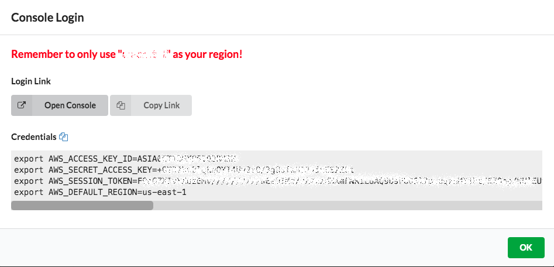

# AWS Systems Manager Workshop Introduction

This workshop is intended to provide a 200 level hands on experience with core AWS Systems Manager capabilities. Lets start with a brief overview of AWS Systems Manager capabilities: 

1.	**Resource Groups** - Group AWS resources together by any purpose or activity you choose, such as application, environment, region, project, campaign, business unit, or software lifecycle.
2.	**Documents** - Centrally define the configuration options, policies, and the actions that Systems Manager performs on your managed instances and other AWS resources.
3.	**Run Command** - Run a command, with rate and error controls, that targets an entire fleet of managed instances.
4.	**Session Manager** - Securely connect to a managed instance with a single click, without having to open an inbound port or manage SSH keys. 
5.	**Distributor** - Distributor lets you package your own software - or find AWS-provided software packages - to install on AWS Systems Manager managed instances.
6.	**State Manager** - Use and create runbook-style SSM documents that define the configuration state for your managed instances or other AWS resources.
7.	**Patch Manager** – Simplify your operating system patching process for Windows and Linux.
8.	**Maintenance Window** - Automatically perform tasks during defined windows of time.
9.	**Compliance** - Quickly see which resources in your account are out of compliance and take corrective action from a centralized dashboard.
10.	**Parameter Store** - Separate your secrets and configuration data from your code by using parameters, with or without encryption, and then reference those parameters from a number of other AWS services.
11.	**Inventory** - Perform automated inventory by collecting metadata about your Amazon EC2, on-premises, or other cloud managed instances. Metadata can include information about applications, network configurations, and more.
12.	**Automation** - Automate or schedule a variety of operation, maintenance, and deployment tasks.
13.	**OpsCenter** - Centrally view, investigate, and resolve operational work items related to AWS resources.
14.	**Change Calendar** - Create calendar events to allow or block changes to your AWS resources.
15.	**Explorer** - View consolidated operations data from multiple AWS accounts and Regions that you manage. 
16.	**AppConfig** - Create, manage, and safely deploy application configuration data to your targets at runtime.
17.	**Hybrid Activations** - Create an activation to register on-premises servers and virtual machines (VMs), non-AWS Cloud servers, and other devices with AWS Systems Manager. Centrally manage Amazon EC2 instances and your hybrid environment from one location.

## Workshop Agenda
- AWS Systems Manager Foundational Knowledge - Labs README, 1, 2, 17
- AWS Systems Manager Run Command and Automation - Labs 3, 12
- AWS Systems Manager State Manager - Labs 6
- AWS Systems Manager Distributor	- Labs 5
- AWS Systems Manager Session Manager - Labs 4, 16
- AWS Systems Manager Patch Manager - Labs 7
- AWS Systems Manager Maintenance Window and Change Calendar - Labs 8, 14
- AWS Systems Manager Compliance, OpsCenter, and Explorer - Labs 9,13,15
- AWS Systems Manager Inventory - Labs 11
- AWS Systems Manager Parameter Store - Labs 10
- AWS AppConfig - Lab 18

## Accessing AWS Account for Hands-on Labs

1.	Browse to https://dashboard.eventengine.run 
2.	Log in with the team hash that is provided to you – This will be your own account


3.	Log into the console using the provided Login Link


	 
Note: Once the event is complete, the account will be deleted.  

## Setup - Managed Instances

We will need to have a couple instances deployed to work with throughout the workshop.  This will be provided to the participants as homework ahead of the day or the workshop to ensure we have enough time to get through the material. 

## Create Key Pair
1. In the AWS management console navigate to us-east-1.
2. Use your administrator account to access the Amazon EC2 console at https://console.aws.amazon.com/ec2/.
3. In the EC2 navigation pane under **Network & Security**, select Key Pairs and then select **Create Key Pair**.
4. In the **Create Key Pair** dialog box, type a **Key pair name** such as **SM-Workshop** and then select **Create**.
5. Save the keypairname.pem file for optional later use accessing the EC2 instances created in this lab.

## Create an IAM Role and Instance Profile for Systems Manager
By default, AWS Systems Manager doesn't have permission to perform actions on your instances. You must grant access by using an AWS Identity and Access Management (IAM) instance profile. An instance profile is a container that passes IAM role information to an Amazon Elastic Compute Cloud (Amazon EC2) instance at launch. Servers and virtual machines (VMs) in a hybrid environment require an IAM role to communicate with the Systems Manager service. The role grants AssumeRole trust to the Systems Manager service. You only need to create the service role for a hybrid environment once for each AWS account.

1. Create an Instance Profile for Systems Manager managed instances:
   - Navigate to the IAM console
   - In the navigation pane, select **Roles**.
   - Then select **Create role**.
   - In the **Select type of trusted entity** section, verify that the default **AWS service** is selected.
   - Immediately under **Choose the service that will use this role**, choose **EC2**, and then choose **Next: Permissions**.
1. On the **Attach permissions policies** page, do the following:
   - Use the **Search** field to locate the **AmazonSSMManagedInstanceCore**. Select the box next to its name.
1. Choose **Next: Tags**.
1. Choose **Next: Review** as we are not adding any tags to the IAM instance role.
1. In the **Review** section:
   - Enter a **Role name**, such as **SM-Workshop-ManagedInstancesRole**.
     - This info will be used later on in the lab when provisioning new instances
   - Accept the default in the **Role description**.
   - Choose **Create role**.

## Deploy Managed Instances

In this section we will deploy four EC2 managed instances that we will work with throughout the workshop.

1. Open the Amazon EC2 console at https://console.aws.amazon.com/ec2.
1. In the navigation pane, select **Instances**.
1. Choose **Launch Instance**.
    - On the **Step 1: Choose an Amazon Machine Image (AMI)** page, select **Amazon Linux 2 AMI (HVM), SSD Volume Type**.
    - On the **Step 2: Choose an Instance Type** page, select **t2.micro**, and choose **Next: Configure Instance Details**.
    - On the **Step 3: Configure Instance Details** page, perform the following steps:
        - For **Number of instances**, enter ```4```.
        - For **Auto-assign Public IP**, ensure auto-assign public IP is enabled.
        - For **IAM Role**, select the IAM role previously created, **SM-Workshop-ManagedInstancesRole**. This is what allows instances to be managed by Systems Manager.
        - Choose **Next: Add Storage**.
    - Leave the defaults and choose **Next: Add Tags**.
        - Do not add tags as we will create some later in the workshop.
    - Choose **Next: Configure Security Group**.
    - On the **Step 6: Configure Security Group** page, choose **Select an existing security group** and then select the Security Group named **default** with the description **default VPC security group**.
    - Choose **Review and Launch**.
    - Choose **Launch**.
    - Choose **Proceed without a key pair** from the drop-down menu and select the box for **I acknowledge that I will not be able to connect to this instance unless I already know the password built into this AMI.**
        - We do not need to launch our EC2 instances with key pairs as we can remotely connect later in the workshop using Session Manager.
    - Choose **Launch Instances**.

1. Go back to view instances and ensure that all four EC2 instances transition to an **Instance State** of ```running```.
1. For two of the EC2 instances, add the following tags:
    - For **Key**, enter ```Name```.
    - For **Value**, enter ```App1``` for one instance and ```App2``` for the other.
    - Choose **Save**.
1. For the remaining two EC2 instances, add the following tags:
    - For **Key**, enter ```Name```.
    - For **Value**, enter ```Web1``` for one instance and ```Web2``` for the other.
    - Choose **Save**.