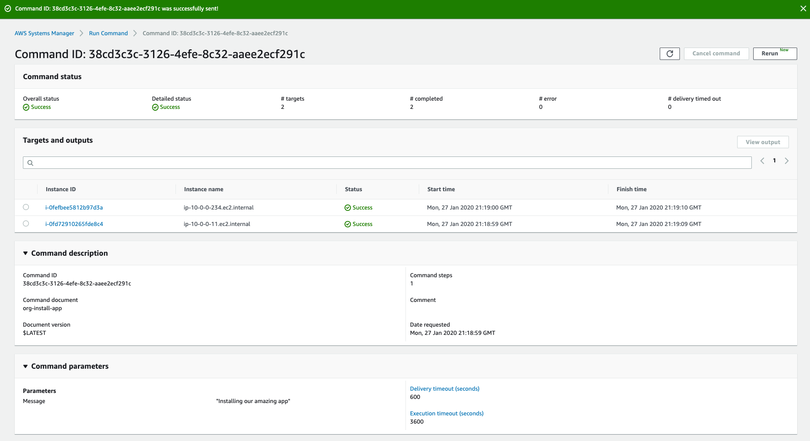
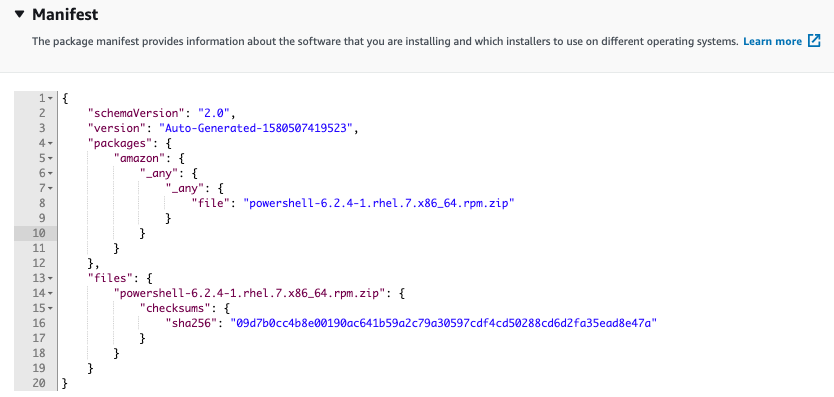
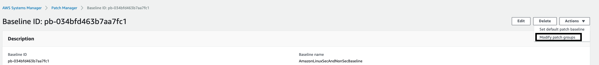
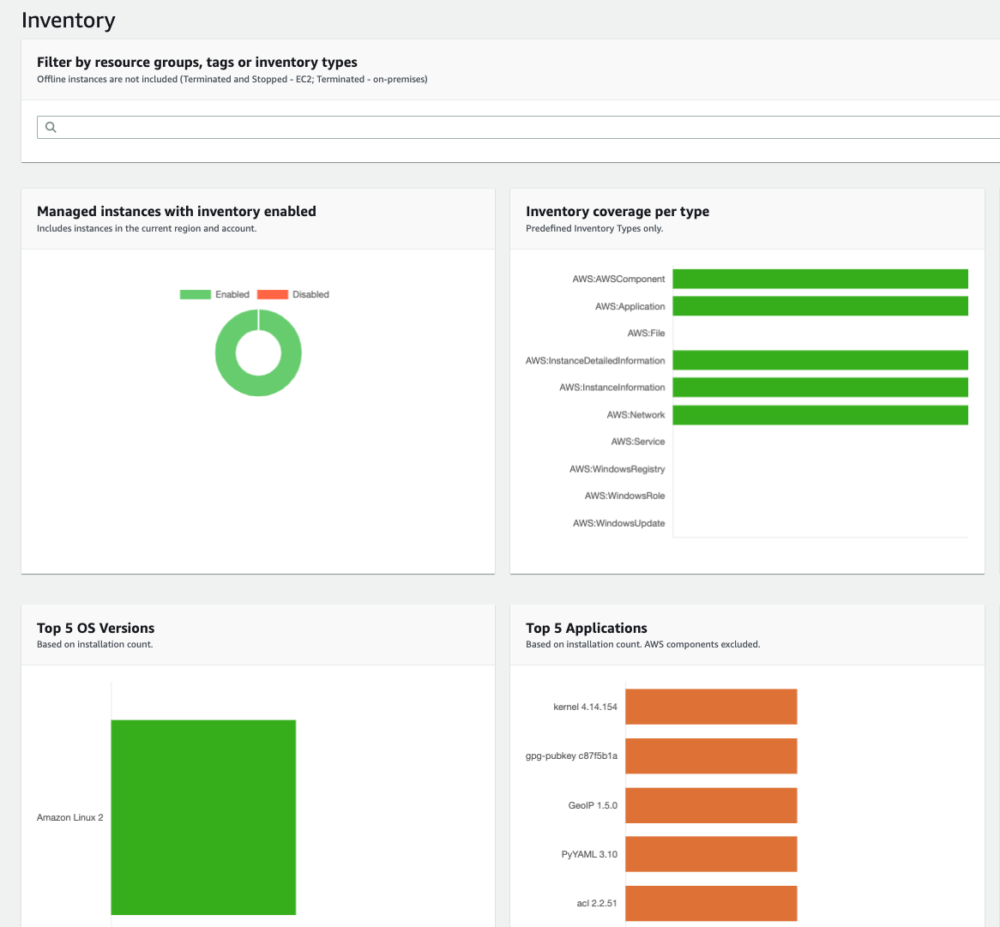
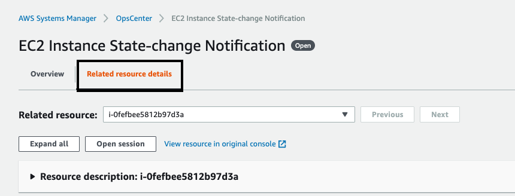
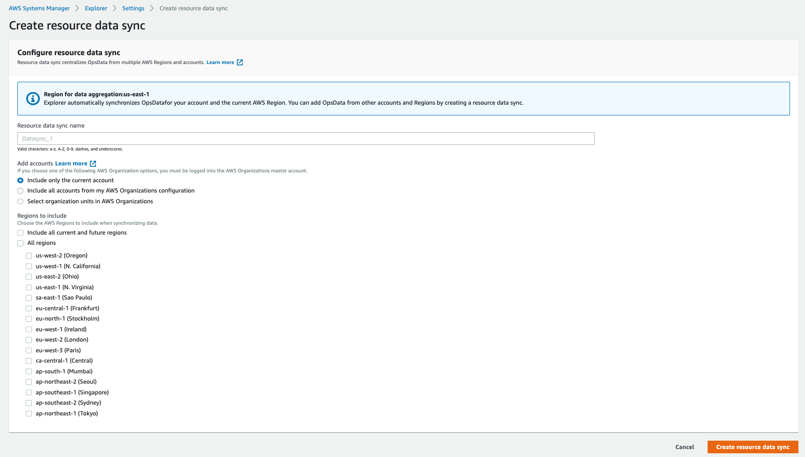
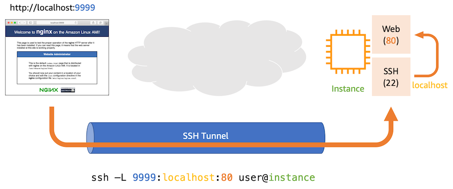
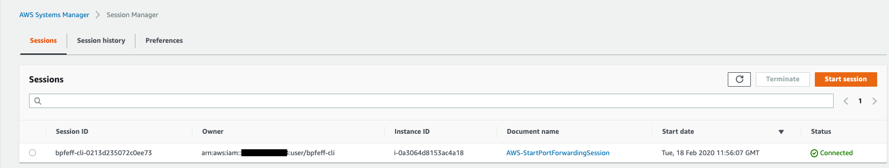
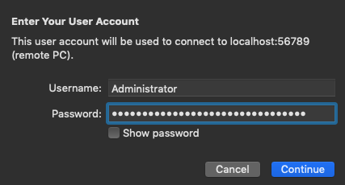

Systems Manager Workshop Lab Introduction
=========================================

This workshop is intended to provide a 200-300 level hands on experience
with core AWS Systems Manager capabilities.

1.  **Resource Groups** - Group AWS resources together by any purpose or
    activity you choose, such as application, environment, region,
    project, campaign, business unit, or software lifecycle.

2.  **Documents** - Centrally define the configuration options and
    policies for your managed instances.

3.  **Run** - Run a command, with rate and error controls, that targets
    an entire fleet of managed instances.

4.  **Session Manager** - Securely connect to a managed instance with a
    single click, without having to open an inbound port or manage SSH
    keys.

5.  **Distributor** - Distributor lets you package your own software -
    or find AWS-provided software packages - to install on AWS Systems
    Manager managed instances.

6.  **State Manager** - Use and create runbook-style SSM documents that
    define the actions to perform on your managed instances.

7.  **Patch Manager** -- Simplify your operating system patching process
    for Windows and Linux.

8.  **Maintenance Window** - Automatically perform tasks in defined
    windows of time.

9.  **Compliance** - Quickly see which resources in your account are out
    of compliance and take corrective action from a centralized
    dashboard.

10. **Parameter Store** - Separate your secrets and configuration data
    from your code by using parameters, with or without encryption, and
    then reference those parameters from a number of other AWS services.

11. **Inventory** - Perform automated inventory by collecting metadata
    about your Amazon EC2 and on-premises managed instances. Metadata
    can include information about applications, network configurations,
    and more.

12. **Automation** - Automate or schedule a variety of maintenance and
    deployment tasks.

13. **OpsCenter** - Centrally view, investigate, and resolve operational
    work items related to AWS resources.

14. **Change Calendar** - Create calendar events to allow or block
    changes to your AWS resources

15. **Explorer** - View consolidated inventory data from multiple AWS
    Regions and accounts that you manage.

16. **AppConfig** - Create, manage, and safely deploy application
    configuration data to your targets at runtime.

17. **Hybrid Activations** - Create an activation to register
    on-premises servers and virtual machines (VMs), non-AWS Cloud
    servers, and other devices with AWS Systems Manager. Centrally
    manage Amazon EC2 instances and your hybrid environment from one
    location.

You will need the following things:
-----------------------------------

-   Laptop with internet connectivity

-   100 level knowledge of AWS services and the AWS Management Console

-   Enable Navigation Pane within this document to make browsing easier
    (View \> Navigation Pane \> Left hand side select the list one 2^nd^
    from left)

Accessing AWS Account
---------------------

AWS will provide accounts to use when going through this workshop. We
use an Amazon developed tool called EventEngine that creates the
accounts. This is also the tool that you will use to gain access to the
accounts.

1.  Browse to <https://dashboard.eventengine.run>

```{=html}
<!-- -->
```
18. Log in with the team hash that is provided to you -- This will be
    your own account

19. {width="3.47087489063867in"
    height="1.3657403762029747in"}

20. Log into the console using the provided Login Link

21. {width="3.52129593175853in"
    height="1.695553368328959in"}

22. Once the event is complete, the account will be deleted.

Setup - Managed Instances
-------------------------

We will need to have a couple instances deployed to work with throughout
the workshop. This will be provided to the participants as homework
ahead of the day or the workshop to ensure we have enough time to get
through the material.

### Create Key Pair

1.  In the management console navigate to us-east-1

2.  Use your administrator account to access the Amazon EC2 console
    at [[https://console.aws.amazon.com/ec2/]{.underline}](https://console.aws.amazon.com/ec2/).

3.  In the EC2 navigation pane under **Network & Security**,
    select **Key Pairs** and then select **Create Key Pair**.

4.  In the **Create Key Pair** dialog box, type a **Key pair name** such
    as SM-Workshop and then select **Create**.

5.  **Save the** keypairname.pem **file** for optional later
    use [[accessing the EC2
    instances]{.underline}](https://docs.aws.amazon.com/AWSEC2/latest/UserGuide/AccessingInstancesLinux.html) created
    in this lab.

### Create a Managed Instance IAM Role / Instance Profile

An IAM role is used to register instances with Systems Manager. IAM role
is used for Systems Manager Managed Instance (MI) in AWS and MI's using
an activation code in hybrid configurations.

1.  Create an Instance Profile for Systems Manager managed instances:

    a.  Navigate to the [IAM
        console](https://console.aws.amazon.com/iam/)

    b.  In the navigation pane, select **Roles**.

    c.  Then select **Create role**.

    d.  In the **Select type of trusted entity** section, verify that
        the default **AWS service** is selected.

    e.  In the **Choose the service that will use this role** section,
        scroll past the first reference to EC2 (**EC2 Allows EC2
        instances to call AWS services on your behalf**) and
        choose **EC2** from within the field of services. This will open
        the **Select your use case** section further down the page.

    f.  In the **Select your use case** section, choose **EC2 Role for
        AWS Systems Manager** to select it.

    g.  Select **Next: Permissions**.

2.  Under **Attached permissions policy**, verify
    that **AmazonEC2RoleforSSM** is listed

    a.  Select **Next: Tags** -- Do not add any

    b.  Select **Next: Review**

3.  In the **Review** section:

    a.  Enter a **Role name**, such
        as **SM-Workshop-ManagedInstancesRole**.

        1.  This info will be used later on in the lab when provisioning
            new instances

    b.  Accept the default in the **Role description**.

    c.  Choose **Create role**.

### Create IAM Role for Maintenance Window Tasks

This step is **critical** and could cause issues further into the
workshop if not completed.

<https://docs.aws.amazon.com/systems-manager/latest/userguide/sysman-maintenance-perm-console.html>

1.  [Create the
    role](https://docs.aws.amazon.com/systems-manager/latest/userguide/sysman-maintenance-perm-console.html) that
    allows Systems Manager to tasks in Maintenance Windows on your
    behalf:

    a.  Navigate to the [IAM
        console](https://console.aws.amazon.com/iam/).

    b.  In the navigation pane, select **Roles**, and then
        select **Create role**.

    c.  In the **Select type of trusted entity** section, verify that
        the default **AWS service** is selected.

    d.  In the **Choose the service that will use this role** section,
        choose **EC2**. This allows EC2 instances to call AWS services
        on your behalf.

    e.  Select **Next: Permissions**.

2.  Under **Attached permissions policy**:

    a.  Search for **AmazonSSMMaintenanceWindowRole**.

    b.  Check the box next to **AmazonSSMMaintenanceWindowRole** in the
        list.

    c.  Select **Next: Tags**

    d.  Select **Next: Review**

3.  In the **Review** section:

    a.  Enter a **Role name**, such as
        **SM-Workshop-MaintenanceWindowRole**.

    b.  Enter a **Role description**, such as Role for Systems Manager
        Maintenance Window.

    c.  Select **Create role**. Upon success you will be returned to
        the **Roles** screen.

4.  To enable the service to run tasks on your behalf, we need to edit
    the trust relationship for this role:

    a.  Select the role you just created to enter its **Summary** page.

    b.  Select the **Trust relationships** tab.

    c.  Select **Edit trust relationship**.

    d.  Delete the current policy, and then copy and paste the following
        policy into the **Policy Document** field:

{

\"Version\": \"2012-10-17\",

\"Statement\": \[{

\"Sid\": \"\",

\"Effect\": \"Allow\",

\"Principal\": {

\"Service\": \[

\"ec2.amazonaws.com\",\"ssm.amazonaws.com\",\"sns.amazonaws.com\"

\]

},

\"Action\": \"sts:AssumeRole\"

}\]

}

5.  Select **Update Trust Policy**. You will be returned to the now
    updated Summary page for your role.

6.  Copy the **Role ARN** to your clipboard by choosing the double
    document icon at the end of the ARN.

### Assign IAM PassRole Permissions

When you register a task with a Maintenance Window, you specify the role
you created, which the service will assume when it runs tasks on your
behalf. To register the task, you must assign the IAM PassRole policy to
your IAM user account **[(TeamRole).]{.underline}** The policy in the
following procedure provides the minimum permissions required to
register tasks with a Maintenance Window.

1.  To create the IAM PassRole policy for your Administrators IAM user
    group:

    a.  In the IAM console navigation pane, select **Policies**, and
        then select **Create policy**.

    b.  On the Create policy page, in the **Select a service area**,
        next to **Service** select **Choose a service**, and then
        select **IAM**.

    c.  In the **Actions** section, search for **PassRole** and check
        the box next to it when it appears in the list.

    d.  In the **Resources** section, select "You choose actions that
        require the **role** resource type.", and then select **Add
        ARN** to restrict access. The Add ARN(s) window will open.

    e.  In the **Add ARN(s)** window, in the **Specify ARN for role
        field**, delete the existing entry, paste in the role ARN you
        created in the previous procedure, and then select **Add** to
        return to the Create policy window.

    f.  Select **Review policy**.

    g.  On the **Review Policy** page, type a name in the **Name** box,
        such as **SSM-Workshop-MaintenanceWindowPassRole-Policy** and
        then select **Create policy**. You will be returned to
        the **Policies** page.

2.  To assign the IAM PassRole policy to your TeamRole:

    a.  In the IAM console navigation pane, select **Roles**, and then
        select your **TeamRole** to reach its Summary page.

    b.  Under the permissions tab, select **Attach Policy**.

    c.  On the **Attach Policy** page, search for
        **SSM-Workshop-MaintenanceWindowPassRole-Policy**, check the box
        next to it in the list, and select **Attach Policy**. You will
        be returned to the Summary page for the group.

### Deploy Managed Instances

In this section we will deploy 4 managed instances that we will work
with throughout the lab.

1.  Navigate to the [EC2 Console](https://console.aws.amazon.com/ec2)

2.  Go to Instances

3.  Launch Instance

    a.  Amazon Linux 2 (64-bit)

    b.  T2.micro

    c.  Configure instance details

    d.  Number of instances = 4

    e.  Default VPC

    f.  No preference on subnet

    g.  Ensure auto-assign public IP is enabled

    h.  IAM Role = **SM-Workshop-ManagedInstancesRole** (previously
        created -- this is what allows instances to work with Systems
        Manager)

    i.  Default Storage

    j.  Leave Tags as is -- We will create some later in the workshop

    k.  Create a new Security Group -- Allow TCP 22 from anywhere

    l.  Launch

    m.  Select the Key Pair that you previously created

4.  Go back to view instances and ensure that all 4 transition to an
    Instance State of running

5.  Add tag

    a.  key=**Name** and value=**App1/App2** for two of the four
        instances

    b.  key=**Name** and value=**Web1/Web2** for remaining two

Labs
====

Resource Groups + Tags
----------------------

This section will cover creating a Resource Group and some tags that
will be used later on in the Patch Manager lab.

1.  Navigate to the Systems Manager Console \> Application Management \>
    [Resource
    Groups](https://console.aws.amazon.com/systems-manager/resource-groups)

2.  Create a resource group (on the right)

3.  From navigation panel on the left, under **Tagging** select **Tag
    Editor**

    a.  Region = us-east-1

    b.  Resource types = AWS::EC2::Instance

    c.  Select **Search resources**

    d.  Select 2 of the 4 instances \> Select **Manage Tags of selected
        resources**

    e.  Add tag

        i.  Key = Patch Group

        ii. Value = App

    f.  Select **Review and apply tag changes**

4.  From navigation panel on the left, under **Resources** select
    **Create Resource Group**

    a.  Select **Tag based**

    b.  Under Resource Types select **AWS::EC2::Instance**

    c.  Under Tags enter

        i.  Key = Patch Group

        ii. Value = App

    d.  Select **View Group Resources**

{width="7.1in" height="1.4701388888888889in"}

5.  In the group name enter **App**

6.  In group tags you can add more tags to the full group if you would
    like -- Key = App / Value = Front-end

    a.  These group tags do not show up under the individual resources
        -- It is another layer of tagging that can be done to the
        Resource Group

7.  Select **Create Group**

8.  Repeat the above steps for the remaining 2 Instances but tag them as
    **Web**

Documents
---------

In this section we will create a custom document that can be used with
other Systems Manager capabilities like Distributor, Run, and State
Manager.

1.  Navigate to the [Systems Manager
    Console](https://us-east-1.console.aws.amazon.com/systems-manager/documents) \>
    Shared Resources \> Documents

2.  Inside here you will be able to see all documents available to your
    account in the region you are presently logged into

    a.  Owned by Amazon = Managed Documents published and maintained by
        AWS

    b.  Owned by me = Custom Documents your organization has created

    c.  Shared with me = Documents that you have been granted access to
        within that region

    d.  All documents = All of the above

3.  Navigate to Owned by me

4.  Select **Create Command or Session**

    a.  **Name =** org-install-app

    b.  **Target Type =** Leave blank for now -- This allows you to
        narrow down the resources the doc can run against

    c.  **Document Type =** Command document as we will use Run command
        to install the package

    d.  Copy the below snippet into the contents

> **{**
>
> **\"schemaVersion\": \"2.2\",**
>
> **\"description\": \"Command Document Example JSON Template\",**
>
> **\"parameters\": {**
>
> **\"Message\": {**
>
> **\"type\": \"String\",**
>
> **\"description\": \"Magic\",**
>
> **\"default\": \"Installing our amazing app\"**
>
> **}**
>
> **},**
>
> **\"mainSteps\": \[**
>
> **{**
>
> **\"action\": \"aws:runShellScript\",**
>
> **\"name\": \"Magic\",**
>
> **\"inputs\": {**
>
> **\"runCommand\": \[**
>
> **\"sudo yum install httpd -y\",**
>
> **\"mkdir /app\",**
>
> **\"touch /app/hello.txt\",**
>
> **\"sudo systemctl start httpd\"**
>
> **\]**
>
> **}**
>
> **}**
>
> **\]**
>
> **}**

5.  Select **Create Document**

6.  Browse to Documents \> Owned by me and confirm that the new document
    exists

    a.  Select on the name of the document

    b.  Browse to Content and review the contents of the document -- We
        will use this with the Run command

Run
---

This section we will utilize the Run command to execute our newly built
Document against our application instances.

1.  Navigate to the [Systems Manager Console \> Instances and Nodes \>
    Run
    Command](https://console.aws.amazon.com/systems-manager/run-command)

2.  Select **Run Command**

3.  Select inside the search box under **Command Document** to apply a
    filter

    a.  Select or enter -- Owner : Owned by me

    b.  Select **org-install-app**

4.  Under Document Version select **Latest Version at Runtime**

5.  Under **Targets** we will select a **Resource Group**

    a.  Select Web (*created earlier in Resource Groups + Tags section*)

    b.  Leave **resource types** as All available resource types

6.  Leave other parameters and Rate Control as default

7.  Uncheck enable writing to an S3 bucket

8.  Uncheck enable writing to CloudWatch Logs ([ideal solution to
    storing and viewing
    logs](a.%09https:/docs.aws.amazon.com/systems-manager/latest/userguide/sysman-rc-setting-up-cwlogs.html))
    -- (*Unchecked by default*)

9.  Select **Run**

10. You will be brought over to the Command Status of the Run Command
    session you created

    a.  {width="5.694444444444445in"
        height="3.1050984251968505in"}

11. Select one the instance IDs to drill down for details about the
    execution of the run command (stdout)

    a.  Expand **Step 1 -- Output** (Max of 2500 characters)

    b.  Alternatively select CloudWatch Logs and you can view the entire
        output

12. We will now use Session Manager to view that our Run command was
    successful

Session Manager
---------------

In this lab we will utilize Session Manager to connect to our App
instances that we executed our Run command against. Session Manager is a
tool that allows administrators Quickly and securely access your Amazon
EC2 instances through an interactive one-click browser-based shell or
through the AWS CLI without the need to open inbound ports, maintain
bastion hosts, or manage SSH keys.

The IAM user or role must have Session Manager permissions as well as
access to the target Managed Instances. When a version of SSM Agent that
supports Session Manager starts on an instance, it creates a user
account with root or administrator privileges called **ssm-user**. On
Linux machines, the account is added to **/etc/sudoers**. On Windows
machines, it is added to the **Administrators** group. Sessions are
launched using these user accounts. On Windows machines you will be
dropped into a Powershell terminal .

1.  Navigate to [Systems Manager \> Instances & Nodes \> Session
    Manager](https://console.aws.amazon.com/systems-manager/session-manager)

2.  Select **Start Session**

3.  Select one of the **Web** servers we were just working on

4.  Select **Start Session**

5.  You will be directed to a new tab and presented with the shell of
    the target **App** server

6.  Switch back to the **Session Manager** tab and select refresh -- You
    can now see the active session you've established

7.  Switch back to the tab with your active session and type following
    commands

    a.  pwd

        i.  It will result in **/usr/bin**

    b.  cd /

    c.  cd app

    d.  ls

        i.  You can see our text file "hello.txt" created by Run
            Document above.

    e.  systemctl status httpd -- apache is now running per our document
        instructions

8.  Select **Terminate** at the top right of the session

9.  Go back to **Session Manager** and select refresh -- You can see the
    session was ended and there are no running sessions

10. Select **Session History**

11. You will see your previous session in a Terminating state -- We will
    now configure session logging in CloudWatch Logs

12. Navigate to [Services \> Management & Governance \> CloudWatch \>
    Log Groups](https://console.aws.amazon.com/cloudwatch)

13. Select Actions \> Create Log Group

    a.  **NOTE:** Your role needs to have the appropriate [permissions
        within
        CloudWatch](a.%09https:/docs.aws.amazon.com/systems-manager/latest/userguide/session-manager-logging-auditing.html#session-manager-logging-auditing-cloudwatch-logs)

        i.  In this lab, the team role has

14. Enter **Systems-Manager-Workshop** as the name

15. Navigate back to Session Manager

16. Configure **Preferences**

    a.  {width="3.4287029746281714in"
        height="0.9222353455818023in"}

17. Under Send Session output to CloudWatch Logs check the CloudWatch
    logs box

    a.  Uncheck Encrypt log data (can be enabled on the CloudWatch (CW)
        Logs group)

    b.  Select a log group name from the list =
        **Systems-Manager-Workshop**

    c.  Select **Save**

18. Repeat steps 4-8

19. Return to **Session Manager \> Session History** (This will be in a
    terminating state for 1-3 minutes as the history is sent to
    CloudWatch Logs for storage)

    a.  Select refresh

20. Once the status is **Terminated** you can select the output location
    -- **CloudWatch Logs** (open in a new tab since it will redirect the
    page that you're are currently on)

21. In CloudWatch Logs you will see that inside your Systems Manager Log
    Group a new Log Stream was created and utilized the ID of the
    Session Manager session you just ended

22. Expand the messages and you will see a full output of the terminal
    session

    a.  {width="4.196311242344707in"
        height="2.2175929571303588in"}

23. This is powerful because now you have an easy interface to review
    session logs and you can also create metric filters and alert of
    specific log file entries (e.g. sudo) and send messages to an SNS
    topic and the communications type

Distributor (Optional Lab)
--------------------------

Distributor is a capability that allows you to create custom packages
for deployment to your Managed Instances. This could be helpful for
application or tools deployment to your fleet. In this scenario we will
deploy Powershell Core to a Linux Managed Instance.

**Reference Video =** <https://www.youtube.com/watch?v=AvQWkfgEQI8>

1.  Need to make an S3 bucket to store the package in

    a.  Navigate to [S3](https://s3.console.aws.amazon.com/s3)

    b.  Select Create Bucket

    c.  Enter something like -- YOURFIRSTNAME10-sm

    d.  Region = us-east (N. Virginia)

    e.  Keep all defaults

    f.  Block all public access

    g.  Create Bucket

2.  Download the following package locally:

    a.  <https://github.com/PowerShell/PowerShell/releases/download/v6.2.4/powershell-6.2.4-1.rhel.7.x86_64.rpm>

3.  Navigate to [Systems Manager \> Instances & Nodes \>
    Distributor](https://console.aws.amazon.com/systems-manager/distributor)

4.  Select **Create Package**

5.  Select **Simple Package** (Advanced allows you to specify your own
    install/uninstall scripts)

6.  Enter -- **Posh-linux** for the name

7.  Select the bucket you made in step 1

8.  Enter a prefix of Linux

9.  Select **Add Software** under Upload

    a.  Select the rpm you downloaded in step 2

    b.  Set the **Target Platform** as amazon

    c.  Set Platform Version as \_any

    d.  Set **Architecture** as x86\_64

    e.  If you expanded scripts you can see that distributor has already
        provided the appropriate install / uninstallation scripts

    f.  {width="2.3024693788276465in"
        height="1.4861111111111112in"}

10. If you expand **Manifest** you will see the package you are
    installing and the which installers to use depending on OS

    a.  {width="2.4994181977252845in"
        height="1.1898151793525809in"}

11. Select **Create Package**

12. Your manifest file and package data will be uploaded to the
    specified S3 bucket

### Install Custom Package

Now that you have your custom package uploaded to your S3 bucket along
with the manifest. Distributor gives you 2 quick options to deploy your
package. You can either install on a schedule or install one time.
Installing on a schedule automatically prepares a **State Manager
Association** with the pre-defined **Document** of
**AWS-ConfigureAWSPackage** and the name of your custom package as a
parameter. Install one time does the same preparation but uses **Run
Command**.

{width="3.1666666666666665in"
height="0.45893700787401576in"}

State Manager
-------------

**State Manager** is a tool that allows administrators to Maintain a
consistent configuration of your instances and applications. **State
Manager** allows you to specify a schedule to reapply your
configurations to your instances. **State Manager** provides similar
functionality to traditional Configuration Management tooling like
Puppet, Chef, and Ansible. You specify a schedule to apply your
**Document** commands to your **Managed Instances** via an
**Association**. In this lab, we will be enabling the pre-defined
**Document** for updating the SSM Agent on targeted **Managed
Instances.**

1.  Navigate to [Systems Manager \> Instances & Nodes \> State
    Manager](https://console.aws.amazon.com/systems-manager/state-manager)

```{=html}
<!-- -->
```
23. Select Create Association (top right)

24. Name = UpdateSSMAgent

25. Search for **AWS-UpdateSSMAgent** and select that as the Document
    for the Association

26. Parameters leave as the Default (false)

27. Targets = Selecting all managed instances in this region under this
    account

28. Specify schedule = On schedule (can run one for initial
    provisioning) / every 30 mins (for the lab)

29. If this was a real world scenario you would like check weekly for a
    new release

30. Compliance = High

31. This is specifying how you like this ranked within the Compliance
    dashboard -- if the agent is not updated you will see a High
    severity non-compliance alert

32. Rate Control = Target 1 and Error 1

33. Leave writing output to S3 bucket unchecked for now

34. Select Create Association

35. {width="2.34259186351706in"
    height="0.5654527559055118in"}

36. Select on the Association ID to review the Association details

37. Then Select Apply Association Now (upper right corner)

38. Select **Apply**

39. Select the Association ID to review the Association details

40. Select **Execution History**

41. Select the most recent **Execution ID**

42. {width="4.001035651793526in"
    height="1.0092596237970253in"}

43. Select the **Output** of one of the Resource IDs

44. {width="4.0120363079615045in"
    height="0.9296281714785651in"}

45. A new tab will open -- Expand **Step 1 -- Output**

46. {width="4.820231846019247in"
    height="1.6435181539807524in"}

47. You can see that output of the **Document** being executed and
    updating the SSM Agent

48. If there are no updates the installation is skipped

Patch Manager
-------------

In this section we will create Patch Baselines and Patch Groups. These
will be used to decide which patches to apply to our instances and which
instances to target.

**Warning** \* **AWS does not test patches for Windows or Linux before
making them available in Patch Manager** . \* **If any updates are
installed by Patch Manager the patched instance is rebooted**.
\* **Always test patches thoroughly before deploying to production
environments. This is a customer owned responsibility.**

Patch Manager uses **patch baselines**, which include rules for
auto-approving patches within days of their release, as well as a list
of approved and rejected patches. Later in this lab we will schedule
patching to occur on a regular basis using a **Systems
Manager** **Maintenance Window** task. Patch Manager integrates with AWS
Identity and Access Management (IAM), AWS CloudTrail, and Amazon
CloudWatch Events to provide a secure patching experience that includes
event notifications and the ability to audit usage.

### High-level Objectives

-   Create a custom patch baseline

-   Create a patch group to associate with the custom patch baseline

### Create Patch Baseline

1.  Under **Instances and Nodes** in the **AWS Systems
    Manager** navigation bar, select **Patch Manager**.

2.  Select the **View predefined patch baselines** link under
    the **Configure patching** button on the upper right.

3.  Select **Create patch baseline**.

4.  On the **Create patch baseline** page in the **Provide patch
    baseline details** section:

    a.  Enter a **Name** for your custom patch baseline, such
        as **AmazonLinuxSecAndNonSecBaseline**.

    b.  Optionally enter a description, such as Amazon Linux patch
        baseline including security and non-security patches.

    c.  Select **Amazon Linux 2** from the list.

5.  In the **Approval rules** section:

```{=html}
<!-- -->
```
a.  Examine the options in the lists and ensure
    that **Product**, **Classification**, and **Severity** have values
    of **All**.

b.  Leave the **Auto approval delay** at its default of **0 days**.

c.  Change the value of **Compliance reporting -
    optional** to **Critical**.

d.  Select **Add another rule**.

e.  In the new rule, change the value of **Compliance reporting -
    optional** to **Medium**.

f.  Check the box under **Include non-security updates** to include all
    Amazon Linux 2 updates when patching.

If an approved patch is reported as missing, the option you select
in **Compliance reporting**, such as Critical or Medium, determines the
severity of the compliance violation reported in System
Manager **Compliance**.

1.  In the **Patch exceptions** section in the **Rejected patches -
    optional** text box, enter **system-release.\*** 

    a.  This will [reject
        patches](https://docs.aws.amazon.com/systems-manager/latest/userguide/patch-manager-approved-rejected-package-name-formats.html) to
        new Amazon Linux releases that may advance you beyond the [Patch
        Manager supported operating
        systems](https://docs.aws.amazon.com/systems-manager/latest/userguide/patch-manager-supported-oses.html) prior
        to your testing new releases.

2.  For Linux operating systems, you can optionally define
    an [alternative patch source
    repository](https://docs.aws.amazon.com/systems-manager/latest/userguide/patch-manager-how-it-works-alt-source-repository.html).
    Select the **X** in the **Patch sources** area to remove the empty
    patch source definition.

3.  Select **Create patch baseline** and you will go to the **Patch
    Baselines** page where the AWS provided default patch baselines, and
    your custom baseline, are displayed.

### Create and Assign a Patch Group

A [patch
group](https://docs.aws.amazon.com/systems-manager/latest/userguide/sysman-patch-patchgroups.html) is
an optional method to organize instances for patching. For example, you
can create patch groups for different operating systems (Linux or
Windows), different environments (Development, Test, and Production), or
different server functions (web servers, file servers, databases). Patch
groups can help you avoid deploying patches to the wrong set of
instances. They can also help you avoid deploying patches before they
have been adequately tested.

You create a patch group by using Amazon EC2 tags. Unlike other tagging
scenarios across Systems Manager, a patch group must be defined with the
tag key: **Patch Group** (tag keys are case sensitive). You can specify
any value (for example, web servers) but the key must be Patch Group.
**Note**: An instance can only be in one patch group.

1.  Navigate to the [EC2 Console](https://console.aws.amazon.com/ec2)

2.  Go to **tags** on the left navigation panel.

3.  Select **Manage Tags**

4.  Select instances with Name App1 and App2

5.  Add Tag

6.  Key = Patch Group

7.  Value = App

8.  Select instances with Name Web1 and Web2

9.  Add Tag

10. Key = Patch Group

11. Value = Web

12. Navigate back to [Systems Manager \> Patch Manager \> Patch
    Baselines](https://console.aws.amazon.com/systems-manager/patch-manager/baselines)

13. Select the Baseline you created in the previous part
    (AmazonLinuxSecAndNonSecBaseline)

14. Go to Actions and Modify Patch
    Group{width="7.1in"
    height="0.8175185914260718in"}

15. Type in App and Add the Patch Group to the Baseline

From here you could utilize **AWS-RunPatchBaseline** pre-defined
document to scan or patch your instances. Instead we are going to chain
the capabilities together and utilize a Maintenance Window to execute
the Run command and document mentioned above.

**NOTE:** You can also Select Configure Patching and link the Patch
Baseline to the Maintenance Window, it will register the run task with
the maintenance window and also register the Patch Group as targets. It
utilizes the existing role AWSServiceRoleforAmazonSSM.

Maintenance Window
------------------

In this section we will create a Maintenance Window to be used within
Patch Manager. We will be using the default service-linked role for
Systems Manager. Custom Roles can be created to restrict actions a
service can perform within a Maintenance Window and selected during the
association of a Maintenance Window and a service.

### High-level Objectives

1.  Create the window and define its schedule and duration.

2.  Assign targets for the window.

3.  Assign tasks to run during the window

### Create Maintenance Window

First, you must [create the
window](https://docs.aws.amazon.com/systems-manager/latest/userguide/sysman-maintenance-create-mw.html) and
define its schedule and duration:

1.  Open the AWS [Systems Manager
    console](https://console.aws.amazon.com/systems-manager/).

2.  In the navigation pane, select **Maintenance Windows** and then
    select **Create a Maintenance Window**.

3.  In the **Provide maintenance window details** section:

    a.  In the **Name** field, type a descriptive name to help you
        identify this Maintenance Window, such
        as **Patch-amznlin2-app**.

    b.  (Optional) you may enter a description in
        the **Description** field.

    c.  Select **Allow unregistered targets** if you want to allow a
        Maintenance Window task to run on managed instances, even if you
        have not registered those instances as targets.

    d.  **Note:** If you select **Allow unregistered targets**, then you
        can select the unregistered instances (by instance ID) when you
        register a task with the Maintenance Window. If you don't, then
        you must select previously registered targets when you register
        a task with the Maintenance Window.

        1.  Specify a schedule for the Maintenance Window by using one
            of the scheduling options:

        2.  To have the maintenance window execute more rapidly while
            engaged with the lab:

            a.  Select **Rate schedule builder** under Schedule

            b.  Set **Window starts** to 5 minutes.

        3.  Real world configuration would be similar to:

            a.  Under **Specify with**, use **Cron schedule builder**.

            b.  Under **Window starts**, select the third option,
                specify **Everyday**, and select a time, such as 02:00.

            c.  In the **Duration** field, type the number of hours the
                Maintenance Window should run, such as '2' **hours**.

            d.  In the **Stop initiating tasks** field, type the number
                of hours before the end of the Maintenance Window that
                the system should stop scheduling new tasks to run, such
                as 1 **hour before the window closes**. Allow enough
                time for initiate activities to complete before the
                close of the maintenance window.

4.  Select **Create maintenance window**. The system returns you to
    the **Maintenance Window** page. The state of the Maintenance Window
    you just created is **Enabled**.

### Assigning Targets to the Patch Window

After you create a Maintenance Window, you [assign
targets](https://docs.aws.amazon.com/systems-manager/latest/userguide/sysman-maintenance-assign-targets.html) that
the tasks will run against. In this case, we will utilize the Patch
Group we created previously containing the 2 app servers.

1.  On the **Maintenance windows** page, select the **Window ID** of
    your maintenance window to enter its Details page.

2.  Select **Actions** in the top right of the window and
    select **Register targets**.

3.  On the **Register target** page under **Maintenance window target
    details**:

    a.  In the **Target Name** field, enter a name for the targets, such
        as App.

    b.  (Optional) Enter a description in the **Description** field.

    c.  (Optional) Specify a name or work alias in the **Owner
        information** field. **Note**: Owner information is included in
        any CloudWatch Events that are raised while running tasks for
        these targets in this Maintenance Window.

4.  In the **Targets** section, under **Select Targets by**:

    a.  Select the default **Specifying tags** to target instances by
        using Amazon EC2 tags that were previously assigned to the
        instances.

    b.  Under **Tags**, enter 'Patch Group' as the key and 'App' as the
        value. The option to add an additional tag key/value pair will
        appear.

5.  Select **Register target** at the bottom of the page to return to
    the maintenance window details page.

If you want to assign more targets to this window, select
the **Targets** tab, and then select **Register target** to register new
targets. With this option, you can select a different means of
targeting. For example, if you previously targeted instances by instance
ID, you can register new targets and target instances by specifying
Amazon EC2 tags.

### Assigning Tasks to Maintenance Window

This part is critical to ensure that the IAM role is setup properly for
Maintenance Window use. After you assign targets, you [assign
tasks](https://docs.aws.amazon.com/systems-manager/latest/userguide/sysman-maintenance-assign-tasks.html) to
perform during the window:

1.  From the details page of your maintenance window,
    select **Actions** in the top right of the window and
    select **Register Run command task**.

2.  On the **Register Run command task** page:

```{=html}
<!-- -->
```
a.  In the **Name** field, enter a name for the task, such
    as **PatchTestAppServers**.

b.  (Optional) Enter a description in the **Description** field.

```{=html}
<!-- -->
```
3.  In the **Command document** section:

    a.  Select the search icon, select Platform Types, and then
        select Linux to display all the available commands that can be
        applied to Linux instances.

    b.  Select **AWS-RunPatchBaseline** in the list.

    c.  Leave the **Task priority** at the default value of **1** (1 is
        the highest priority).

    d.  Tasks in a Maintenance Window are scheduled in priority order,
        with tasks that have the same priority scheduled in parallel.

4.  In the **Targets** section:

    a.  For **Target by**, select **Selecting registered target
        groups**.

    b.  Select the group you created from the list.

5.  In the **Rate control** section:

    a.  For **Concurrency**, leave the default **targets** selected and
        specify 1.

    b.  For **Error threshold**, leave the default **errors** selected
        and specify 1.

6.  In the **Role** section, specify the role you defined with the
    AmazonSSMMaintenanceWindowRole. It will
    be **SM-Workshop-MaintenanceWindowRole** if you followed the
    suggestion in the instructions above.

7.  In **Output options**, leave **Enable writing to S3** unchecked.

    a.  (Optionally) Specify **Output options** to record the entire
        output to a preconfigured **S3 bucket** and optional **S3 key
        prefix** \>**Note**\
        Only the last 2500 characters of a command document's output are
        displayed in the console. To capture the complete output define
        and S3 bucket to receive the logs.

8.  In **SNS notifications**, leave **Enable SNS
    notifications** unchecked.

    a.  (Optional) Specify **SNS notifications** to a
        preconfigured **SNS Topic** on all events or a specific event
        type for either the entire command or on a per-instance basis.

9.  In the **Parameters** section, under **Operation**,
    select **Install**.

10. You can also toggle if you want a Reboot to be triggered after
    installation or schedule it at another time (NoReboot)

11. Select **Register Run command task** to complete the task definition
    and return to the details page.

### Reviewing Run Command Status and Output

This section will show you how to check the status of the Run command
using the Management Console.

1.  After allowing enough time for your maintenance window to complete:

    a.  Navigate to the AWS [Systems Manager
        console](https://console.aws.amazon.com/systems-manager/).

    b.  Select **Maintenance Windows**, and then select the **Window
        ID** for your new maintenance window.

2.  On the **Maintenance window ID** details page, select **History**.

3.  Select a **Windows execution ID** and select **View details**.

4.  On the **Command ID** details page, scroll down to the **Targets and
    outputs** section, select an **Instance ID**, and select **View
    output**.

5.  Select **Step 1 - Output** and review the output.

6.  Select **Step 2 - Output** and review the output.

### Checking Patch Compliance

This section will cover

1.  Under **Instances & Nodes** in the AWS Systems Manager navigation
    bar, select **Compliance**.

2.  On the **Compliance** page in the **Compliance resources summary**,
    you will now see that there are 2 systems that are listed as
    **Compliant Resources**. In the **Resources** list, you will see the
    individual compliance status and details.

3.  You can also sort by **Patch Group** or **Resource Group**

Compliance
----------

Compliance is intended to be a dashboard where you can influence what is
important to you and your organization by specifying a Severity level
during configuration and present on if it is compliant with the task.
For example, you might have an Association that you want to know is
being applied to your instance (host firewall configuration). Another
example would be if your instances have been patched according to the
configured Patch Baseline.

1.  Navigate to [Systems Manager \> Instances & Nodes \>
    Compliance](https://console.aws.amazon.com/systems-manager/compliance)

```{=html}
<!-- -->
```
49. Compliance will allow you to sort by Compliance Type, Patch Group,
    or Resource Group

50. Sort by Resource Group

51. You can now review the compliance status of the **Resource Group**
    we created earlier in the lab

52. {width="5.638888888888889in"
    height="2.726786964129484in"}

53. If you have thousands of instances this view can get overwhelming --
    You can further drill down the results by using the **Filter
    Further** search bar

54. {width="1.9189195100612424in"
    height="1.4583333333333333in"}

55. Any time you see an item for **Compliance** within a dashboard, this
    is where you can influence how that information is displayed within
    this dashboard (Critical, high, medium, and low)

Parameter Store
---------------

Parameter Store is a secure location to keep secrets and configuration
information. It allows you to dynamically and securely retrieve data as
you need it vs saving it within the Operating System or configuration
files.

1.  Navigate to [Systems Manager \> Application Management \> Parameter
    Store](https://console.aws.amazon.com/systems-manager/parameters)

```{=html}
<!-- -->
```
56. Fill out the data for adding your secret

57. **Name** **=** YOURNAME-secret1

58. **Description** **=** blank

59. **Tier** **=** Standard

60. **Type** **=** SecureString

61. **KMS Key Source** **=** My current account (uses the default KMS
    key or specify a CMK of your choice)

62. **KMS Key ID** **=** alias/aws/ssm (AWS managed key for Systems
    Manager)

63. **Value =** This is your secret data whether that is configuration
    data, passwords, connection strings, etc...

64. **Tags =** your choice -- this is ideal to organize your secrets so
    you do not get lost --

    a.  Key=Team / Value=Operations

    b.  Key=Application / Value=RevenueGen1

    c.  Key=Owner / YOURNAME

65. Select **Create Parameter**

66. You are brought back to the **Parameter Store** home screen and now
    select your new secret

67. You can Select **Show** to reveal the contents of the secret

    a.  {width="4.554651137357831in"
        height="1.8055555555555556in"}

68. History will show you the users who created, updated, or deleted the
    secret

69. Versions of the parameter are kept but if you delete the parameter
    then the history is deleted as well

### Retrieve Secret from CLI \[Optional\]

Most use cases you would not be using the Management Console to retrieve
your secrets. You would be using the CLI or SDK to programmatically
gather this information as part of the task you are performing. Below is
a basic exercise to gather the secret you made previously.

1.  Navigate back to <https://dashboard.eventengine.run>

```{=html}
<!-- -->
```
70. Pull up the credentials from Dashboard

    a.  {width="1.4572801837270342in"
        height="1.2824070428696412in"}Select **AWS Console**

    b.  {width="3.52129593175853in"
        height="1.695553368328959in"}Gather your access keys

71. Install AWS CLI -
    <https://docs.aws.amazon.com/cli/latest/userguide/install-cliv2.html>

72. Once installed run aws configure and use the access keys above --
    region = us-east-1

73. We made our secret a SecureString -- When we run aws ssm
    get-parameter without the decryption flag you can see the value of
    the parameter is obscured

74. Command = aws ssm get-parameter \--name "YOURNAME-secret1"

    a.  {width="3.5074070428696413in"
        height="1.1049846894138233in"}

75. Now we add the with decryption flag

76. Command = aws ssm get-parameter \--name \"bills-secret1\"
    \--with-decryption

    a.  {width="3.52129593175853in"
        height="1.0986832895888015in"}

77. You can see that the value is now in plain text

78. Then you would parse the JSON output with something like jq to be
    able to get the raw value

79. Command = aws ssm get-parameter \--name \"bills-secret1\"
    \--with-decryption \| jq -r \".Parameter.Value\"

    a.  {width="6.725in"
        height="0.2927055993000875in"}

Inventory
---------

Inventory allows you to collect a software catalog and configuration
information for your instances. It leverages **State Manager** to create
an association that runs the pre-defined document
AWS-GatherSoftwareInventory on an interval that you specify. You can
further extend the functionality of inventory by enabling a **Resource
Data Sync**. This functionality Resource data sync lets you sync
inventory data to Amazon S3. You can sync inventory data collected from
multiple AWS accounts or regions to a single S3 bucket, thus enabling a
single view of inventory data across AWS accounts or regions.

1.  Navigate to [Systems Manager \> Instances & Nodes \>
    Inventory](https://console.aws.amazon.com/systems-manager/inventory)

2.  Under the Dashboard tab select **Setup Inventory**

3.  Inventory Association Configuration Details

    a.  Name = Keep default

    b.  Targets = Selecting all managed instances in this account (you
        can target this association if you don't want all instances
        included)

    c.  Schedule = Keep default (30 minutes)

    d.  Parameters = Keep all defaults

    e.  Advanced = Leave unchecked we will configure this separately

4.  Select **Setup Inventory**

5.  Select **View Details** (top right inside the green success banner
    -- If not, go to State Manager and drill into the details of the
    **Association** named **Inventory-Association**

6.  Navigate back to the **Inventory** landing page

    a.  You can now see data is being populated into the Dashboard

    b.  {width="2.741428258967629in"
        height="2.5416666666666665in"}

7.  Select **Detailed View** tab on the **Inventory** landing page

8.  Make an S3 bucket before creating the **Resource Data Sync**

    a.  **NOTE:** If you did the Distributor Lab and created a bucket
        for **Systems Manager** usage then just use that and create an
        Inventory prefix so your data remains organized

    b.  Navigate to [S3](https://s3.console.aws.amazon.com/s3)

    c.  Select **Create Bucket**

    d.  Enter something like -- YOURFIRSTNAME10-sm

    e.  **Region =** us-east (N. Virginia)

    f.  Keep all defaults

    g.  Block all public access

    h.  Create Bucket

    i.  Go to the **Permissions** tab

    j.  Go to Bucket policy

    k.  Enter in your Bucket Name and select save

{

\"Version\": \"2012-10-17\",

\"Statement\": \[

{

\"Sid\": \"SSMBucketPermissionsCheck\",

\"Effect\": \"Allow\",

\"Principal\": {

\"Service\": \"ssm.amazonaws.com\"

},

\"Action\": \"s3:GetBucketAcl\",

\"Resource\": \"arn:aws:s3:::ENTERYOURBUCKET\"

},

{

\"Sid\": \" SSMBucketDelivery\",

\"Effect\": \"Allow\",

\"Principal\": {

\"Service\": \"ssm.amazonaws.com\"

},

\"Action\": \"s3:PutObject\",

\"Resource\": \[

\"arn:aws:s3:::ENTERYOURBUCKET/inventory/\*\"

\],

\"Condition\": {

\"StringEquals\": {

\"s3:x-amz-acl\": \"bucket-owner-full-control\"

}

}

}

\]

}

9.  Navigate back to [Inventory \> Resource Data
    Sync](https://console.aws.amazon.com/systems-manager/managed-instances/resource-data-sync)

10. Select Create resource data sync

11. Configuration details

    a.  Sync name = YOURNAME-inventory-s3-sync

    b.  Bucket name = the name of the bucket your created previously

    c.  Bucket prefix = inventory

    d.  Bucket region = us-east-1

    e.  KMS key = leave blank for the purpose of the demo

    f.  Select **Create**

12. Switch back to your bucket and you can now see the data being synced

    a.  {width="2.072684820647419in"
        height="2.8367443132108487in"}

    b.  Now we have a clean data structure for inventory data

    c.  From here you can utilize Athena and Quicksight to gain deeper
        insight about the inventory data gathered

    d.  Tutorial here =
        <https://docs.aws.amazon.com/systems-manager/latest/userguide/sysman-inventory-datasync.html>

{width="3.704346019247594in"
height="2.4583333333333335in"}

Automation
----------

The Automation capability allows you to execute multi-step, complex IT
tasks. In this lab we are going to utilize the pre-defined Automation
Document called AWS-ReszieInstance. I felt this was a good example to
show case a task that we would typically say is easy or simple. Consider
this scenario, if you were an administrator of a business that had
10,000 instances across 3 regions. The finance team worked with
Enterprise Support to perform a Cost Optimization analysis and
identified 2,500 instances running larger instance types than are
necessary for the workload. You are now tasked with resizing them.
Automation and Maintenance Window can now take what would be a painful
task and turn it into a planned tasked that one person can execute in
one maintenance window.

1.  Navigate to [Systems Manager \> Actions & Change \>
    Automation](https://console.aws.amazon.com/systems-manager/automation)

2.  Select **Execute Automation (or skip to step 3 depending on if
    existing Automation workflows exist)**

3.  Select the **Preferences** tab

4.  Select **Edit**

5.  Select send output to CloudWatch Logs

6.  Select send output to the default log group

7.  Select **Save**

8.  Go to the **Executions** tab

9.  Select **Execute Automation**

10. In **Choose document** go to **Owned by Amazon**

11. Under **Document Categories** go to **Cost management**

12. Select **AWS-ResizeInstance**

13. Select **Next**

    a.  {width="3.903166010498688in"
        height="2.6849540682414696in"}

14. Fill out the details for **Execute automation document**

    a.  InstanceId = Toggle Show Interactive instance picker on and
        select 1 instance

    b.  InstanceType = String for the Instance type -- t2.small

        i.  <https://aws.amazon.com/ec2/instance-types/>

    c.  You can see that the CLI output is squeezed into a one line

aws ssm start-automation-execution \--document-name
\"AWS-ResizeInstance\" \--document-version \"\\\$DEFAULT\" \--parameters
\'{\"InstanceId\":\[\"i-0fefbee5812b97d3a\"\],\"InstanceType\":\[\"t2.small\"\]}\'
\--region us-east-1

d.  Select **Execute**

    i.  {width="3.768561898512686in"
        height="3.54629593175853in"}

```{=html}
<!-- -->
```
15. You can see that multiple steps executed whereas with Run command we
    are doing singular executions of Documents

    a.  Step 1 failed because it is complaining that the desired
        instance type is different than the existing ( :P )

16. Navigate to [EC2](https://console.aws.amazon.com/ec2/v2) and find
    your instance ID -- You can now see the instance type is t2.small

    a.  You could find the API calls in CloudTrail as well but for the
        purposes of this lab we kept it simple

OpsCenter
---------

OpsCenters helps provide a regional dashboard to surface infrastructure
related issues. OpsCenter can report on any data that can be fed into
CloudWatch Event Rules and configured as an SSM OpsItem. In this example
we will enable OpsCenter and review the default rules in creates and
look at what a live issue looks like in the dashboard.

1.  Navigate to [Systems Manager \> Operations Management \>
    OpsCenter](https://console.aws.amazon.com/systems-manager/opsitems)

2.  Select **Get started**

3.  Leave the Default Rules item checked

4.  Select **Enable OpsCenter**

    a.  {width="6.330768810148731in"
        height="1.4309864391951006in"}

5.  Several default Roles are used to automatically create several
    default SSM OpsItems Rules in CloudWatch Events

    a.  {width="5.830768810148731in"
        height="2.379870953630796in"}

    b.  Permissions -
        <https://docs.aws.amazon.com/systems-manager/latest/userguide/Explorer-setup-permissions.html>

6.  Let's create an OpsItem / Rule so you can see the power of OpsCenter
    and its ability to aggregate data across AWS services

    a.  Navigate to [CloudWatch \> Events \>
        Rules](https://console.aws.amazon.com/cloudwatch/home?region=us-east-1#rules:)

    b.  Select **Create Rule**

    c.  Event Source = Event Pattern

    d.  Service Name = EC2

    e.  Event Type = EC2 Instance State-change Notification

    f.  Specific States = Terminated

    g.  Any instance

    h.  Target = SSM opsItem

    i.  Role = Allow create new role

    j.  Select **Configure Details**

    k.  Name = YOURNAME-test-ec2-terminated

    l.  State = Enabled

    m.  Select **Create Rule**

    n.  {width="6.461538713910761in"
        height="3.524647856517935in"}

7.  Navigate Back to [Systems Manager \> Operations Management \>
    OpsCenter \> OpsItems \> Configure
    Sources](https://console.aws.amazon.com/systems-manager/explorer/settings?region=us-east-1&source=opscenter)

    a.  You will now see the new CW rule we created

    b.  {width="3.884615048118985in"
        height="1.953325678040245in"}

8.  Navigate to
    [EC2](https://console.aws.amazon.com/ec2/v2/home?region=us-east-1#Instances:sort=tag:Name)

9.  Select an instance and terminate it

    a.  Highlight instance \> Actions \> Instance State \> Terminate

10. Navigate to
    [OpsCenter](https://console.aws.amazon.com/systems-manager/opsitems/?region=us-east-1#activeTab=REPORTING)

11. You will now see OpsItems by Source and age -- Grouped by source =
    EC2

    a.  Under count select the number or go to OpsItem status summary
        and select one of the open items

    b.  {width="5.292307524059493in"
        height="1.2014326334208223in"}

    c.  You will now see our event -- Select the ID (e.g.
        oi-\#\#\#\#\#\#\#\#\#\#\#\#)

    d.  You will see a ton of data regarding the event (aggregate
        sources)

        i.  Related resources shows the ARN of the instance your
            terminated

        ii. Runbooks is powerful as it allows you to take action of the
            event via runbook as the event occurs

        iii. Operational Data will show you the instance ID, the state,
             and the ClouwdWatch Event that generated it

    e.  Go back to **Related resource details** (top left)

        i.  {width="4.3769225721784775in"
            height="1.6691721347331583in"}

        ii. **Resource description** shows you an output of the meta
            data that is displayed in the EC2 console when the instance
            is running

        iii. Tags for the instance are shown

        iv. Details from Config (might take some time to show up in
            Opsitems)

        v.  CloudTrail is powerful as it shows you relevant events about
            what happened (who stopped the instance -- I have seen this
            take a while to sort out besides being just a tail of the CT
            logs in that region -- e.g. tons of assume roles vs the
            related events

        vi. CloudFormation stack resources shows the relevant stack data

12. This concludes our OpsCenter learning -- One thing you can also due
    under OpsItems \> Configure Sources is change the Severity it is
    alerted as (think of the compliance dashboard we did before),
    Category of the event, and the state

    a.  {width="6.169231189851269in"
        height="1.153713910761155in"}

13. I hope this shows you the power of OpsCenter as sometimes it is hard
    to see the value in the tooling -- This is complimentary to other
    tools like CWE, Config, and SNS notifications as it allows you to
    easily respond to events with SSM automation runbooks (think Create
    a ServiceNow incident)

Here is an existing tutorial on how to set this up here:

<https://www.youtube.com/watch?v=r6ilQdxLcqY>

This walks you through the initial configuration of OpsCenter and
triggering different events.

Change Calendar
---------------

Change Calendar is a powerful tool that allows you to specify whether
changes can be executed during a specific date and time automatically.
You can query this information using Automation workflows by
incorporating them into your Automation Document or you can query the
calendar state from AWS CLI.

1.  Navigate to [Systems Manager \> Actions & Change \> Change
    Calendar](https://console.aws.amazon.com/systems-manager/change-calendar/)

2.  Select **Create change calendar**

3.  Enter a name -- YOURNAME-cal-closed

    a.  Description is optional but would make sense to add additional
        meta data especially in complex environments

4.  Calendar type = **Closed by Default**

5.  Select the Calendar name to view the details of the calendar (or
    highlight the radio button and select edit)

6.  Under Events (top left corner) you will see the calendar view and
    the current month and day highlighted with a blue dot and Select
    **Create Event** (top right corner)

7.  Name = yourname-NOCHANGES

8.  Set the start date as the current day and time and make it last for
    2 hours -- Ensure that the calendar time zone is set to your current
    time zone

    a.  NOTE: You can also set reoccurrence which would be a powerful
        tool / use for regular events like application releases or
        change windows

    b.  {width="3.61885498687664in"
        height="3.5923086176727907in"}

9.  The event now shows up on your calendar in light blue on the day you
    specified

10. Go to details (top left corner -- middle)

11. You will now see calendar use which shows you the CLI commands and
    the content that you would add to your Automation Documents to check
    the calendar if the change is allowed or blocked

    a.  {width="5.392307524059492in"
        height="3.351732283464567in"}

12. You will now take this information and you can query the calendar
    from the CLI

    a.  aws ssm get-calendar-state \--calendar-names
        arn:aws:ssm:us-east-1:YOURACCOUNTNUMBER:document/YOURCALENDARNAME
        \--region us-east-1

13. You will see below 2 states -- One where the change time on a closed
    by default calendar is wrong (incorrect time zone) and is blocking
    changes and also one where the correct time zone is configured and
    the calendar is open for the specified period

    a.  {width="6.592307524059493in"
        height="1.7228718285214348in"}

14. One thing to note is that your IAM role / user will need to have the
    appropriate permissions added to the assigned policy to get the
    calendar state

    a.  **ssm:GetCalendarState**

Explorer
--------

Explorer builds on top of OpsCenter and enables you to have a
multi-region / multi-account view of your environment.

1.  Navigate to [Systems Manager \> Operations Management \>
    Explorer](https://console.aws.amazon.com/systems-manager/explorer?region=us-east-1)

2.  Select **Get started**

3.  For tags for reporting -- remove the cloudformation default key (we
    can configure these later on) and select **Enable Explorer**

    a.  {width="5.571071741032371in"
        height="2.3692311898512686in"}

4.  You are presented with an option to configure resource data sync --
    Since we are in the lab and using a single account / single region
    this won't be necessary but worth visualizing

    a.  {width="6.719466316710411in"
        height="3.823076334208224in"}

    b.  This makes it easy to select:

        i.  Select regions you are active in

        ii. Select all accounts in an org

        iii. EVEN COOLER select OUs within an org

5.  Select **Settings** (top right) \> Under Tags for Reporting \> We
    can enter Patch Group and SSM Managed and then select **Save**

6.  

Hybrid Activations
------------------

This lab is a work in progress.

<https://docs.aws.amazon.com/systems-manager/latest/userguide/systems-manager-managedinstances.html>

<https://github.com/awsdocs/aws-systems-manager-user-guide/blob/master/doc_source/sysman-managed-instance-activation.md>

BONUS - Session Manager \[Port Forwarding\]
-------------------------------------------

One common thing that is mentioned when showing **Session Manager** to
folks new to **Systems Manager** is that it doesn't address RDP
sessions. Port Forwarding utilizes SSH tunneling to establish a secure
tunnel between localhost and a remote service.

{width="4.289814085739283in"
height="1.787422353455818in"}

This command tells SSH to connect to instance as user ec2-user, open
**port 9999** on my local laptop, and forward everything from there
to **localhost:80** on the instance. When the tunnel is established, I
can point my browser at **http://localhost:9999** to connect to my
private web server on **port 80.** This lab will demonstrate how to
connect to a Windows instance via Remote Desktop Protocol via **Port
Forwarding with Session Manager**.

### Deploy Windows Instance

1.  Navigate to the [EC2 Console](https://console.aws.amazon.com/ec2)

2.  Go to Instances

3.  Launch Instance

    a.  Microsoft Windows Server 2019 Base

    b.  t2.small

    c.  Configure instance details

    d.  Number of instances = 1

    e.  Default VPC

    f.  No preference on subnet

    g.  Ensure auto-assign public IP is enabled

    h.  IAM Role = ManagedInstancesRole (previously created -- this is
        what allows instances to work with Systems Manager)

    i.  Default Storage

    j.  Leave Tags as is -- We will create some later in the workshop

    k.  Create a new Security Group -- Allow TCP 3389 from anywhere

    l.  Launch

    m.  Select Key Pair that you previously created (this will be used
        to retrieve the admin password for the instance)

4.  Go back to view instances and ensure that all 1 transition to an
    Instance State of running

5.  Navigate to [Systems Manager \> Instances & Nodes \> Managed
    Instances](https://console.aws.amazon.com/systems-manager/managed-instances)

6.  Ensure that the new instance is listed (if not check your IAM role
    attached to the instance)

7.  Grab the instance ID as you will need this for the next section

### Establish CLI Session

1.  Open an AWS CLI session (refer to Accessing AWS Account for your AWS
    keys)

2.  Run the following command

    a.  *aws ssm start-session \--target \"Your Instance ID\"
        \--document-name AWS-StartPortForwardingSession \--parameters
        \"portNumber\"=\[\"3389\"\],\"localPortNumber\"=\[\"56789\"\]*

3.  You will see that your session has started

    a.  {width="3.215740376202975in"
        height="0.7375699912510936in"}

4.  Navigate to [Systems Manager \> Instances & Nodes \> Session
    Manager](https://console.aws.amazon.com/systems-manager/session-manager/sessions)

5.  You will now see your session open inside the console

    a.  {width="4.947222222222222in"
        height="0.9392169728783902in"}

6.  Navigate back EC2 and get your password

    a.  Select **Connect** on your instance

    b.  Select **Get password**

    c.  Select your Key Pair used to deploy the instance

7.  Open your RDP client

8.  Connect to localhost:56789

    a.  {width="2.801971784776903in"
        height="1.5092585301837271in"}

9.  Log in with your Administrator user and password

    a.  If you switch back to your console you will see the latest
        message is "Connection accepted for session -- Meaning you
        established a connection with the remote service on the defined
        local port in your command

10. Wait for login -- t2.micro (t2.small is what should have been used)
    is a bit undersized for Windows Server 2019 and took a while to log
    in

11. Once logged in you can query the instance meta-data to verify you
    are on the right instance -- Open Powershell console

    a.  **Invoke-RestMethod -uri
        http://169.254.169.254/latest/meta-data/public-hostname**

    b.  **Invoke-RestMethod -uri
        http://169.254.169.254/latest/meta-data/instance-id**

12. Got back to your AWS CLI session and kill the command -- You will
    see the RDP session terminate as the tunnel is torn down

13. Navigate back to Session Manager \> Session History and you can see

    a.  Session owner ARN

    b.  Instance ID that was connected to

    c.  Start and end date and time of session

Resources
---------

This section will provide a distilled list of helpful links for learning
more about Systems Manager.

**Systems Manager Overview Videos =** [Youtube
Videos](https://www.youtube.com/watch?v=zwS8lssaY_k&list=PLhr1KZpdzukeH5jKyYi55ef9tEWAllypB)

**Management & Governance Tools Video Playlist =** [Youtube
Videos](https://www.youtube.com/watch?v=vAnIhIwE5hY&list=PLhr1KZpdzukcaA06WloeNmGlnM_f1LrdP)

**Systems Manager User Guide =** [User
Guide](https://docs.aws.amazon.com/systems-manager/latest/userguide/systems-manager-ug.pdf)

**Port Forwarding =** [Port Forwarding Blog
Post](https://aws.amazon.com/blogs/aws/new-port-forwarding-using-aws-system-manager-sessions-manager/)

**Systems Manager User Guide on GitHub =** [User
Guide](https://github.com/awsdocs/aws-systems-manager-user-guide/tree/master/doc_source)
