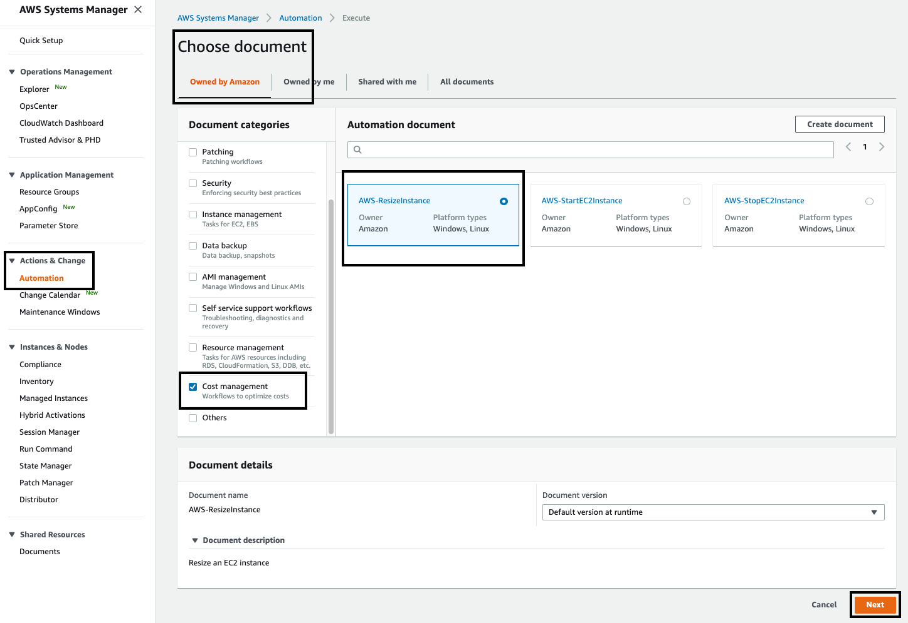

Systems Manager Automation simplifies common maintenance and deployment tasks of EC2 instances and other AWS resources. Automation enables you to do the following:

* Build Automation workflows to configure and manage instances and AWS resources.
* Create custom workflows or use pre-defined workflows maintained by AWS.
* Receive notifications about Automation tasks and workflows by using Amazon CloudWatch Events.
* Monitor Automation progress and execution details by using the Amazon EC2 or the AWS Systems Manager console.

Consider this scenario, if you were an administrator of a business that had 10,000 instances across 3 regions. The finance team worked with Enterprise Support to perform a Cost Optimization analysis and identified 2,500 instances running larger instance types than are necessary for the workload. You are now tasked with resizing them. Automation and Maintenance Window can now take what would be a painful task and turn it into a planned maintenance that one person can execute in a timely manner. 

In this lab we are going to utilize the pre-defined **Automation Document** called **AWS-ResizeInstance**. This example will showcase a multi-step task being executed in a single **Automation** workflow.  

1.  Navigate to [Systems Manager \> Actions & Change \>
    Automation](https://console.aws.amazon.com/systems-manager/automation)
1.  Select **Execute Automation (or skip to step 3 depending on if existing Automation workflows exist)**
1.  Select the **Preferences** tab
1.  Select **Edit**
1.  Select send output to CloudWatch Logs
1.  Select send output to the default log group
1.  Select **Save**
1.  Go to the **Executions** tab
1.  Select **Execute Automation**
1.  In **Choose document** go to **Owned by Amazon**
1.  Under **Document Categories** go to **Cost management**
1.  Select **AWS-ResizeInstance**
1.  Select **Next**



1. Fill out the details for **Execute automation document**
    - InstanceId = Toggle Show Interactive instance picker on and select 1 instance
    - InstanceType = String for the Instance type -- t2.small
        - <https://aws.amazon.com/ec2/instance-types/>
    - You can see that the CLI output is squeezed into a one liner

   ``` 
   aws ssm start-automation-execution \--document-name
    \"AWS-ResizeInstance\" \--document-version \"\\\$DEFAULT\" \--parameters
    \'{\"InstanceId\":\[\"i-0fefbee5812b97d3a\"\],\"InstanceType\":\[\"t2.small\"\]}\'
    \--region us-east-1
    ```
    - Select **Execute**
    


1. You can see that multiple steps executed whereas with Run command we
    are doing singular executions of Documents
1. Navigate to [EC2](https://console.aws.amazon.com/ec2/v2) and find
    your instance ID -- You can now see the instance type is t2.small
  - You could find the API calls in CloudTrail as well but for the
        purposes of this lab we kept it simple
