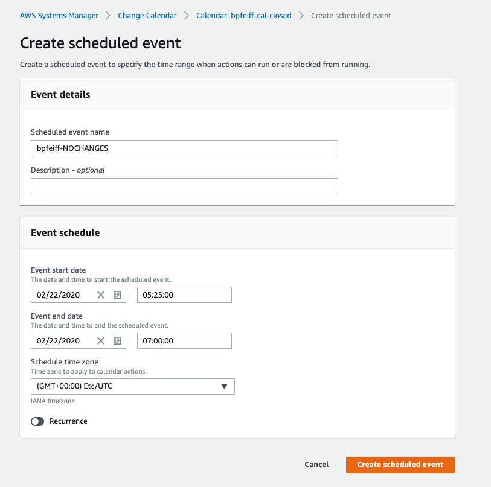

Systems Manager Change Calendar lets you set up date and time ranges when actions you specify (for example, in Systems Manager Automation documents) may or may not be performed in your AWS account. In Change Calendar, these ranges are called events. When you create a Change Calendar entry, you are creating a Systems Manager document of the type ChangeCalendar. In Change Calendar, the document stores iCalendar 2.0 data in plaintext format. Events that you add to the Change Calendar entry become part of the document.

There are two types of Change Calendar entries:

* **DEFAULT_OPEN**: actions can run by default, but are blocked from running during associated events
* **DEFAULT_CLOSED**: actions do not run by default, but can run during events associated with the calendar entry

In this lab, you will create a **Closed by Default Calendar** 

1.  Navigate to [Systems Manager \> Actions & Change \> Change
    Calendar](https://console.aws.amazon.com/systems-manager/change-calendar/)

1.  Select **Create change calendar**

1.  Enter a name -- Ex. YOURNAME-cal-closed

    -  Description is optional but would make sense to add additional
        meta data especially in complex environments

1.  Calendar type: **Closed by Default**

1.  Select the Calendar name to view the details of the calendar (or
    highlight the radio button and select edit)

1.  Under Events (top left corner) you will see the calendar view and
    the current month and day highlighted with a blue dot and Select
    **Create Event** (top right corner)

1.  Name: yourname-NOCHANGES

1.  Set the start date as the current day and time and make it last for
    2 hours -- Ensure that the calendar time zone is set to your current
    time zone

    a.  NOTE: You can also set reoccurrence which would be a powerful
        tool / use for regular events like application releases or
        change windows

1.  The event now shows up on your calendar in light blue on the day you
    specified

1. Go to details (top left corner -- middle)

1. You will now see calendar use which shows you the CLI commands and
    the content that you would add to your Automation Documents to check
    the calendar if the change is allowed or blocked

1. You will now take this information and you can query the calendar
    from the CLI

    - You will need to refer back to the **Event Engine** instructions to get your AWS Keys to configure AWS CLI
    - Installation instructions for common deployments can be found [here](https://docs.aws.amazon.com/cli/latest/userguide/install-cliv2.html)

        aws ssm get-calendar-state \--calendar-names
        arn:aws:ssm:us-east-1:YOURACCOUNTNUMBER:document/YOURCALENDARNAME
        \--region us-east-1

1. You will see 2 states in the screenshot below: 
    - One state where the change time on a closed
    by default calendar is wrong (incorrect time zone) and is blocking
    changes and also 
    - One state where the correct time zone is configured and
    the calendar is open for the specified period

    

    - **NOTE:** your IAM role / user will need to have the
    appropriate permissions added to the assigned policy to get the
    calendar state

        **ssm:GetCalendarState**

1.  For further exploration using **Change Calendar** in **Systems Manager Automation** refer to the following [guide](https://aws.amazon.com/blogs/mt/using-aws-systems-manager-change-calendar-to-prevent-changes-during-critical-events/)