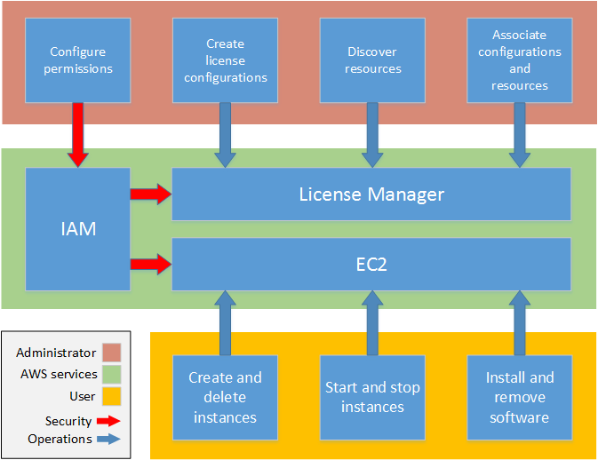

### Introduction

AWS License Manager streamlines the process of bringing software vendor licenses to the cloud. As you build out cloud infrastructure on AWS, you can save costs by using bring-your-own-license (BYOL) opportunities, that is, by repurposing your existing license inventory for use with cloud resources.

License Manager reduces the risk of licensing overages and penalties with inventory tracking that is tied directly into AWS services. With rule-based controls on the consumption of licenses, administrators can set hard or soft limits on new and existing cloud deployments, stopping non-compliant server usage before it happens. A reporting dashboard provides ongoing visibility into license usage and assists with vendor audits.

License Manager helps you manage licenses for the following:

* AWS Cloud resources
* On-premises resources
* Track BYOL software obtained from the [AWS Marketplace](https://aws.amazon.com/marketplace/)

License Manager integrates with Amazon EC2, allowing you to track licenses for the following resources:

EC2 instances
* [Dedicated Instances](https://docs.aws.amazon.com/AWSEC2/latest/UserGuide/dedicated-instance.html)
* [Dedicated Hosts](https://docs.aws.amazon.com/AWSEC2/latest/UserGuide/dedicated-hosts-overview.html)
* [Spot Instances and Spot Fleet](https://docs.aws.amazon.com/AWSEC2/latest/UserGuide/using-spot-instances.html)

Systems Manager
* [Systems Manager Managed Instances](https://docs.aws.amazon.com/systems-manager/latest/userguide/)

Using License Manager along with AWS Systems Manager, you can manage licenses on physical or virtual servers hosted outside of AWS.

License Manager supports tracking any software that is licensed based on **virtual cores (vCPUs)**, **physical cores**, **sockets**, or **number of machines**. This includes a variety of software products from Microsoft, IBM, SAP, Oracle, and other vendors.

Effective software license management relies on the following:

* An expert understanding of language in enterprise licensing agreements
* Appropriately restricted access to operations that consume licenses
* Accurate tracking of license inventory

The following diagram illustrates the distinct but coordinated duties of license administrators, who manage permissions and configure License Manager, and users, who create, manage, and delete resources through the Amazon EC2 console. 

If you are responsible for managing licenses in your organization, you can use License Manager to set up licensing rules, attach them to your launches, and keep track of usage. The users in your organization can then add and remove license-consuming resources without additional work.

A licensing expert manages licenses across the entire organization, determining resource inventory needs, supervising license procurement, and driving compliant license usage. In an enterprise using License Manager, this work is consolidated through the License Manager console. As shown in the diagram, this involves setting service permissions, creating rule-based license configurations, taking inventory of computing resources both on-premises and in the cloud, and associating license configurations with discovered resources. In practice, this could mean associating a license configuration with an approved Amazon Machine Image (AMI) that IT uses as a template for all Amazon EC2 instance deployments.

License Manager saves costs that would otherwise be lost to license violations. While internal audits reveal violations only after the fact, when it is too late to avoid penalties for non-compliance, License Manager prevents expensive incidents from ever occurring. License Manager simplifies reporting with built-in dashboards showing license consumption and resources tracked. 

**Requirements:** Administrator access to an active AWS account and a laptop.
