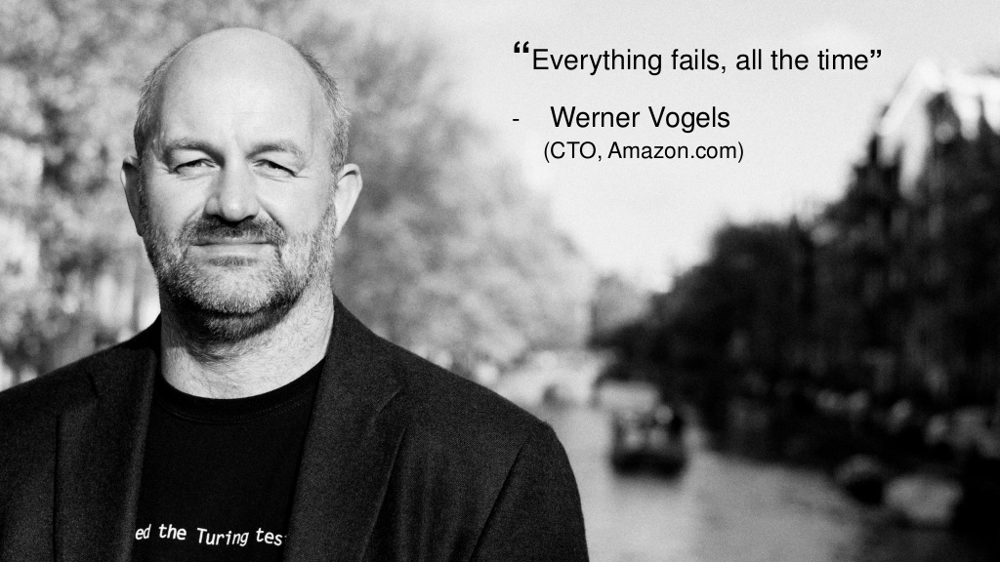

#### Introduction

##### Controls (Management and Governance)

In the past, organizations have had to choose between innovating faster and maintaining control over cost, compliance, and security. With AWS Management and Governance services, customers don’t have to choose between innovation and control—they can have both. Customers choose AWS to help manage and govern their AWS and non-AWS resources. With AWS, customers can enable, provision, and operate their environment for both business agility and governance control. AWS provides services for end-to-end IT lifecycle management, helping customers control and secure their environments, reduce costs, simplify compliance, and enhance operational efficiency.

- [Amazon GuardDuty](https://aws.amazon.com/guardduty/)
- [AWS Config](https://aws.amazon.com/config/)
- [AWS CloudTrail](https://aws.amazon.com/cloudtrail/)
- [Amazon Inspector](https://aws.amazon.com/inspector/)
- [AWS CloudFormation Drift Detection](https://docs.aws.amazon.com/AWSCloudFormation/latest/UserGuide/detect-drift-stack.html)

##### Observability

Modern applications such as those running on microservices architectures generate large volumes of data in the form of metrics, logs, and events. Amazon CloudWatch enables you to collect, access, and correlate this data on a single platform. With AWS X-Ray, you can glean insights into how your application is performing and discover root causes. AWS Personal Health Dashboard provides alerts and remediation guidance when AWS is experiencing events that may impact you.

- [Amazon CloudWatch](https://aws.amazon.com/cloudwatch/)
- [AWS X-Ray](https://aws.amazon.com/xray/)
- [AWS Personal Health Dashboard](https://aws.amazon.com/premiumsupport/technology/personal-health-dashboard/) 

##### Anticipating failure

You should anticipate operational events, both planned (for example, sales promotions, deployments, and failure tests) and unplanned (for example, surges in utilization and component failures). Anomaly Detection analyzes the historical values for the chosen metric, and looks for predictable patterns that repeat hourly, daily, or weekly. It then creates a best-fit model that will help you to better predict the future, and to more cleanly differentiate normal and problematic behavior. CloudWatch Dashboards give you visibility into resource utilization, application performance, and operational health.

- [Amazon CloudWatch Dashboards](https://docs.aws.amazon.com/AmazonCloudWatch/latest/monitoring/CloudWatch_Dashboards.html)
- [Amazon CloudWatch Anomaly Detection](https://docs.aws.amazon.com/AmazonCloudWatch/latest/monitoring/CloudWatch_Anomaly_Detection.html)

##### Events

Amazon CloudWatch Events delivers a near real-time stream of system events that describe changes in Amazon Web Services (AWS) resources. Using simple rules that you can quickly set up, you can match events and route them to one or more target functions or streams. CloudWatch Events becomes aware of operational changes as they occur. CloudWatch Events responds to these operational changes and takes corrective action as necessary, by sending messages to respond to the environment, activating functions, making changes, and capturing state information. 

You can use a CloudWatch alarm to automatically initiate actions on your behalf. An alarm watches a single metric over a specified time period, and performs one or more specified actions, based on the value of the metric relative to a threshold over time. The action is a notification sent to an Amazon SNS topic or an Auto Scaling policy. You can also add alarms to dashboards.

- [Amazon CloudWatch Events](https://docs.aws.amazon.com/AmazonCloudWatch/latest/events/WhatIsCloudWatchEvents.html)
- [Amazon CloudWatch Alarms](https://docs.aws.amazon.com/AmazonCloudWatch/latest/monitoring/AlarmThatSendsEmail.html)