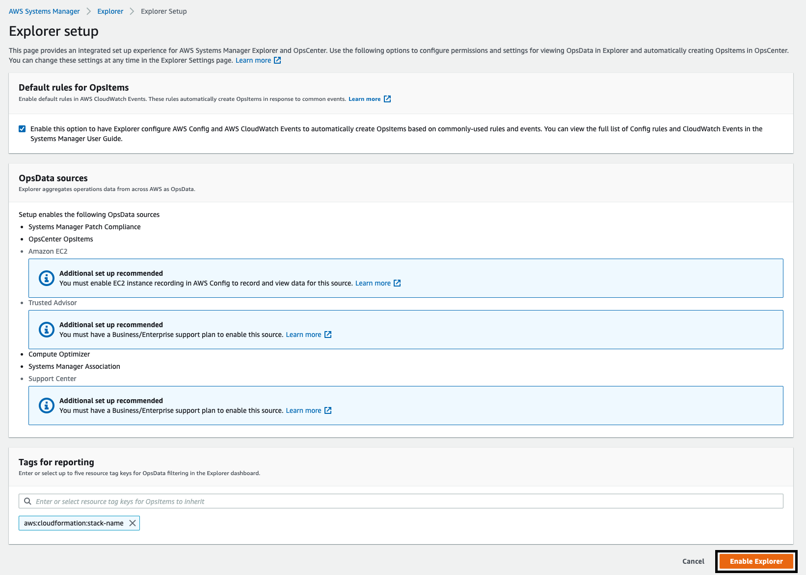
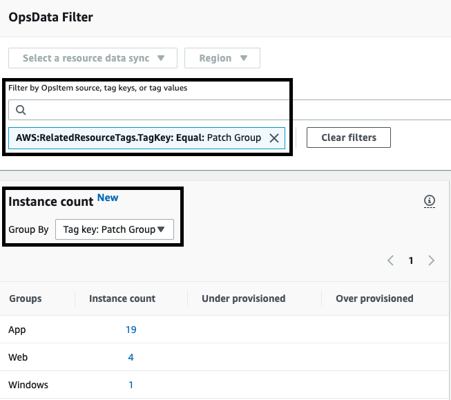
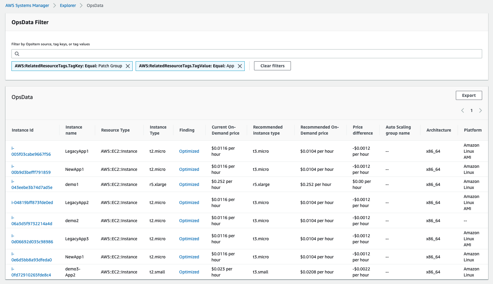

AWS Systems Manager Explorer is a customizable operations dashboard that reports information about your AWS resources. Explorer displays an aggregated view of operations data (OpsData) for your AWS accounts and across Regions. In Explorer, OpsData includes metadata about your EC2 instances, patch compliance details, and operational work items (OpsItems). Explorer provides context about how OpsItems are distributed across your business units or applications, how they trend over time, and how they vary by category. You can group and filter information in Explorer to focus on items that are relevant to you and that require action. When you identify high priority issues, you can use Systems Manager OpsCenter to run Automation runbooks and quickly resolve those issues.

[Getting Started with Explorer](https://docs.aws.amazon.com/systems-manager/latest/userguide/Explorer.html)

In this lab we will enable Explorer and review the options for multi-region multi-account deployment.  

1.  Navigate to [Systems Manager \> Operations Management \>
    Explorer](https://console.aws.amazon.com/systems-manager/explorer?region=us-east-1)

1.  Choose **Get started**

1.  Leave all settings default

1.  Select **Enable Explorer**

    

1.  You are presented with an option to configure **resource data sync** --
    Since we are in the lab and using a single account / single region
    this won't be necessary but worth visualizing

    

    -  This makes it easy to select and configure data collection for:

       - Only regions your organization is active in

       - Select all accounts in an **AWS Organization**

       - Select OUs within an org

1.  Select **Settings** (top right) \> Under Tags for Reporting \> We
    can enter Patch Group and SSM Managed and then select **Save**
    - Enter or select up to five resource tag keys for OpsData filtering in the Explorer dashboard.
    - You can now filter the dashboard view using the tags:
      - The **Instance count** widget can be filtered with the defined tags
      - You can also do a an overall filter on the dataset using tags under **OpsData Filter**
    
1.  Several key items to consider when deciding to use **Explorer** within your environment
    - When you enable a **data resource sync** for all accounts and regions you can get a single dashboard for operational data 
    - If you enable **Compute Optimizer** in **Settings** and go into the **Instance Count** widget and click on a specific on a specific tag grouping you will get rightsizing recommendations focused on that group of instances

    

    - If you enable [**Trusted Advisor**](https://docs.aws.amazon.com/systems-manager/latest/userguide/systems-manager-trusted-advisor-and-phd.html) and **Support Cases** you can get an aggregated view of checks and cases across all of your accounts enabled in the **resource data sync**
    - You can create 5 **resource data syncs** so you can control which data is included in the dashboard