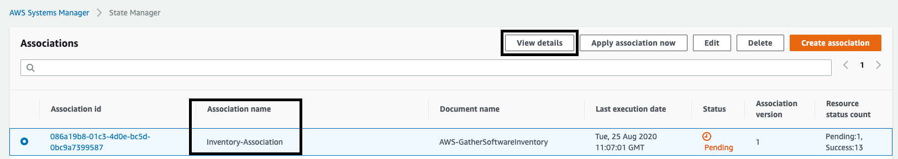
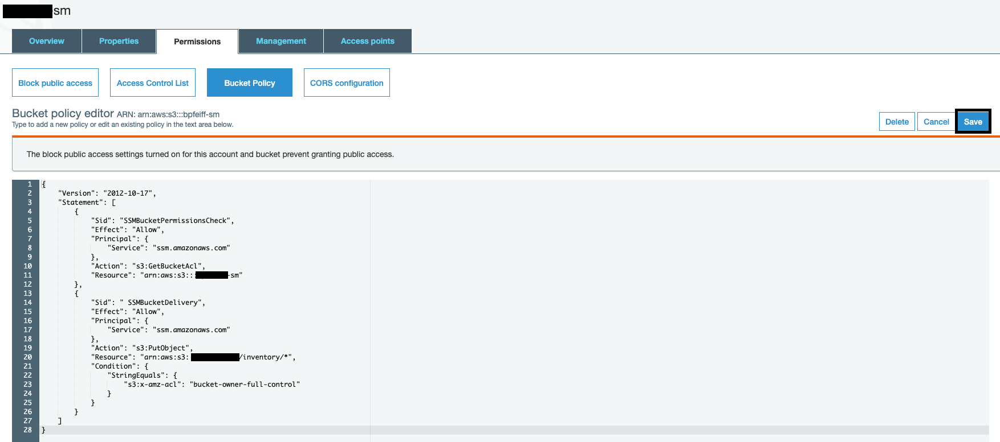
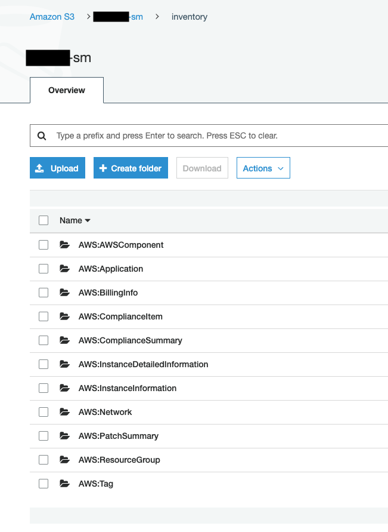
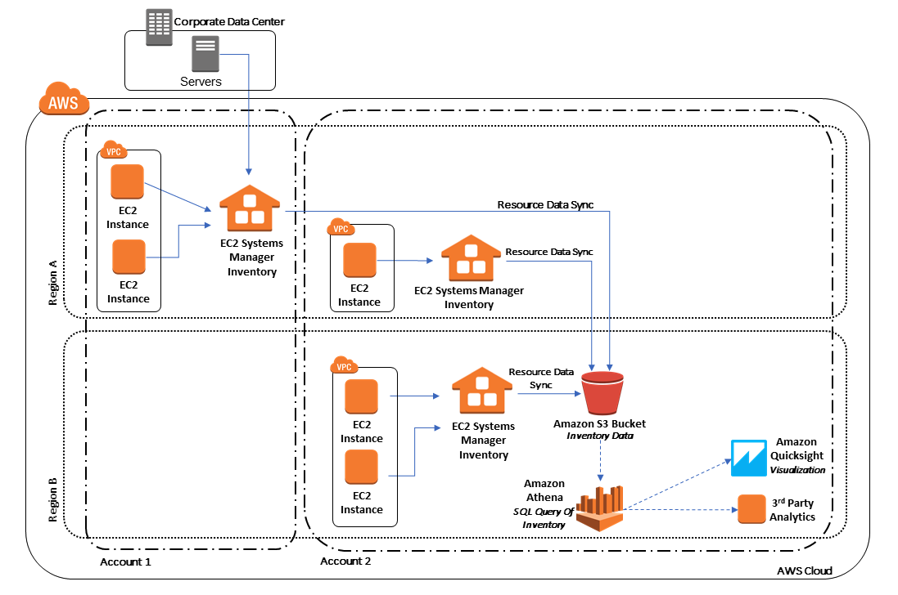

AWS Systems Manager Inventory provides visibility into your Amazon EC2 and on-premises computing environment. You can use Inventory to collect metadata from your managed instances. You can store this metadata in a central Amazon Simple Storage Service (Amazon S3) bucket, and then use built-in tools to query the data and quickly determine which instances are running the software and configurations required by your software policy, and which instances need to be updated. You can configure Inventory on all of your managed instances by using a one-click procedure. You can also configure and view inventory data from multiple AWS Regions and accounts.

In this lab we will enable **Inventory** which leverages **State Manager** to create an **Association** that runs the pre-defined document AWS-GatherSoftwareInventory on an interval that you specify.  We will also configure a **Resource Data Sync** which sends the Inventory data to an S3 bucket for further processing and analysis.  

1.  Navigate to [Systems Manager \> Instances & Nodes \>
    Inventory](https://console.aws.amazon.com/systems-manager/inventory)

1.  Under the Dashboard tab select **Setup Inventory**

1.  Enter the following for **Inventory** Association Configuration Details:

    -  For **Name** keep the default: **Inventory-Association**

    -  For **Targets** select **Choose all instances** - (You can scope the **State Manager Association** down to specific targets if this was a real world scenario)

    -  For **Schedule** keep the default of 30 minutes

    -  For **Parameters** keep all defaults

    -  For **Advanced** leave this unchecked, we will configure this separately

1.  Choose **Setup Inventory**

    

1.  Select **View Details** (top right inside the green success banner)
  
    -  Alternatively, navigate to **State Manager** and drill into the details of the **Association** named **Inventory-Association**

    

1. The **Inventory Association Details** will be the first place to go for troubleshooting.  Navigate to resources and you will see all targets registered with the **Association** and a direct link to their **Run Command output**

1.  Navigate to [Systems Manager \> Instances & Nodes \>
    Inventory](https://console.aws.amazon.com/systems-manager/inventory)

    -  You can now see data is being populated into the Dashboard
    -  **NOTE:** This step may take several minutes to begin populating data within the dashboard

    

1. Now we will configure the **Resource Data Sync** which will ship the inventory data to an S3 bucket for further processing

1.  Make an S3 bucket before creating the **Resource Data Sync**

    - **NOTE:** If you did the Distributor Lab and created a bucket
        for **Systems Manager** usage then just use that and create an
        Inventory prefix so your data remains organized

    - Navigate to [S3](https://s3.console.aws.amazon.com/s3)

    - Select **Create Bucket**

    - For the **Bucket name** enter: YOURFIRSTNAME10-sm

    - For **Region** select **US-East (N. Virginia)**

    - Keep all defaults including **Block all public access**

    - Choose **Create Bucket**

    - Select your newly created bucket to access the configuration details 

    - Navigate to the **Permissions** tab

    - Navigate to **Bucket Policy**

    - Enter in your **Bucket Name** into the policy below and select **Save**

```
{

    "Version": "2012-10-17",

    "Statement": [

        {

            "Sid": "SSMBucketPermissionsCheck",

            "Effect": "Allow",

            "Principal": {

                "Service": "ssm.amazonaws.com"

            },

            "Action": "s3:GetBucketAcl",

            "Resource": "arn:aws:s3:::ENTERYOURBUCKET"

        },

        {

            "Sid": " SSMBucketDelivery",

            "Effect": "Allow",

            "Principal": {

                "Service": "ssm.amazonaws.com"

            },

            "Action": "s3:PutObject",

            "Resource": [

                "arn:aws:s3:::ENTERYOURBUCKET/inventory/*"

            ],

            "Condition": {

                "StringEquals": {

                    "s3:x-amz-acl": "bucket-owner-full-control"

                }

            }

        }

    ]

}
```

    

1.  Navigate back to [Inventory \> Resource Data
    Sync](https://console.aws.amazon.com/systems-manager/managed-instances/resource-data-sync)

1.  Select **Create resource data sync**

1.  Configuration details

    - For **Sync name** enter **YOURNAME-inventory-s3-sync**

    - For **Bucket name** enter the name of the bucket you created previously

    - For **Bucket prefix** enter **inventory** 

    - For **Bucket region** enter **This region (us-east-1)**

    - For **KMS key** leave this blank for the purpose of the demo - Encryption details

    - Choose **Create**

1.  Switch back to your bucket and you can now see the data being synced

    

    - Now we have a clean data structure for inventory data

    - From here you can utilize Athena and Quicksight to gain deeper
        insight about the inventory data gathered

    - **Tutorial:**
        <https://docs.aws.amazon.com/systems-manager/latest/userguide/sysman-inventory-datasync.html>

    