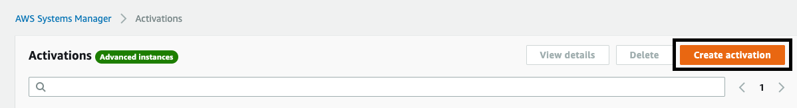
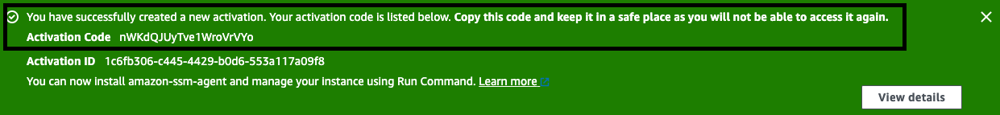
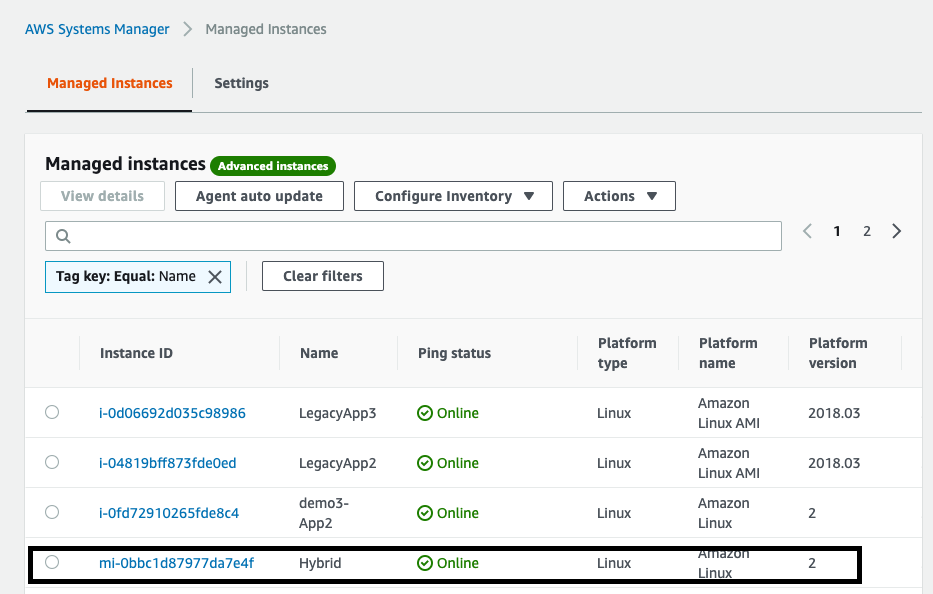

A hybrid environment includes on-premises servers and virtual machines (VMs) that have been configured for use with Systems Manager, including VMs in other cloud environments. To set up servers and virtual machines \(VMs\) in your hybrid environment as Managed Instances, you need to create a managed\-instance activation\. After you successfully complete the activation, you *immediately* receive an Activation Code and Activation ID\. You specify this Code/ID combination when you install SSM Agent on servers and VMs in your hybrid environment\. The Code/ID provides secure access to the Systems Manager service from your managed instances\.

**Important**  
Systems Manager immediately returns the Activation Code and ID to the console or the command window, depending on how you created the activation\. Copy this information and store it in a safe place\. If you navigate away from the console or close the command window, you might lose this information\. If you lose it, you must create a new activation\. 

**About activation expirations**  
An *activation expiration* is a window of time when you can register on\-premises machines with Systems Manager\. An expired activation has no impact on your servers or virtual machines \(VMs\) that you previously registered with Systems Manager\. If an activation expires then you can’t register more servers or VMs with Systems Manager by using that specific activation\. You simply need to create a new one\.

Every on\-premises server and VM you previously registered remains registered as a Systems Manager managed instance until you explicitly deregister it\. You can deregister a managed instance on the **Managed Instances** page of the Systems Manager console, by using the AWS CLI command [deregister\-managed\-instance](https://docs.aws.amazon.com/cli/latest/reference/ssm/deregister-managed-instance.html), or by using the API action [DeregisterManagedInstance](https://docs.aws.amazon.com/systems-manager/latest/APIReference/API_DeregisterManagedInstance.html)\.

In this lab we will create a mock managed instance by deploying an EC2 instance without an IAM Role.  We will then create a Hybrid Activation and manually register the instance.  

## Deploy a Hybrid Instance

1.  Navigate to the [EC2 Console](https://console.aws.amazon.com/ec2)

1.  Go to Instances

1.  Launch Instance
    - AMI: ```Amazon Linux 2 AMI (HVM)```
    - Instance size: ```t2.small```
    - Configure instance details
        -  Number of instances: 1
        - Default VPC
        - No preference on subnet
        - Ensure auto-assign public IP is enabled
        - IAM Role: **DO NOT APPLY AN IAM ROLE TO THE INSTANCE**
        - Default Storage
        - For tags enter Name:Hybrid
        - Create a new Security Group -- Allow TCP 22 from anywhere
    - Launch
    - Select Key Pair that you previously created

1.  Go back to view instances and ensure that all transition to an
    Instance State of running

1.  Navigate to [Systems Manager \> Instances & Nodes \> Managed Instances](https://console.aws.amazon.com/systems-manager/managed-instances)

1.  Ensure that the new instance is listed (if not check your IAM role
    attached to the instance)

1.  Grab the instance ID as you will need this for the next section

## Create an activation 

**To create a managed\-instance activation**

1. Navigate to [Systems Manager \> Instances & Nodes \> Hybrid Activations](https://console.aws.amazon.com/systems-manager/activations?region=us-east-1).

1. Choose **Create activation**\.

   

1. \(Optional\) In the **Activation description** field, enter a description for this activation\. The description is optional, be we recommend that you enter a description if you plan to activate large numbers of servers and VMs\.

1. In the **Instance limit** field, specify the total number of on\-premises servers or VMs that you want to register with AWS as part of this activation\. 

1. In the ** IAM role name** section, choose a service role option that enables your servers and VMs to communicate with AWS Systems Manager in the cloud:

   - For this lab, choose **Use the system created default command execution role** to use a role and managed policy created by AWS\. 

1. In the **Activation expiry date** field, specify an expiration date for the activation\. 
**Note**  If you want to register additional managed instances after the expiry date, you must create a new activation\. The expiry date has no impact on registered and running instances\.

   - For this lab you can leave the expiry date empty

1. \(Optional\) In the **Default instance name** field, specify a name\. 

1. Choose **Create activation**\. Systems Manager immediately returns the Activation Code and ID to the console\. 

- **Note:** It is important that you store the **Activation Code** off to the side (or in Parameter Store) for safe keeping.  It will not be retrievable once you navigate away from the page and require you to recreate the Activation.

   

## Manually Register an Instance the Activation

1. You will need to SSH into the previously created instance

1. Once you have established a session on the instance run the following commands using the **Activation Code and ID** previously created:

```bash
mkdir /tmp/ssm
curl https://s3.amazonaws.com/ec2-downloads-windows/SSMAgent/latest/linux_amd64/amazon-ssm-agent.rpm -o /tmp/ssm/amazon-ssm-agent.rpm
sudo yum install -y /tmp/ssm/amazon-ssm-agent.rpm
sudo systemctl stop amazon-ssm-agent
sudo amazon-ssm-agent -register -code "activation-code" -id "activation-id" -region "region"
sudo systemctl start amazon-ssm-agent
```
1. If you encounter issues with the installation using the code and ID

## Review Hybrid Instance in the Management Console

1. Navigate to [Systems Manager \> Instances & Nodes \> Managed Instances](https://console.aws.amazon.com/systems-manager/managed-instances)

1. You will see your newly registered instance with an instance ID beginning in **mi-** and a Name of Hybrid

   

1. You can now select the **Actions** menu and perform a number of actions just as you would a native AWS Instance

## Things to remember

1. Activations allow you to register servers outside (or inside) of AWS.  This could be a colo facility, another Cloud Provider, or a field device like a Raspberry Pi

1. **Session Manager** usage with Hybrid Instances will require the **Advanced License**

1. Servers registered through Hybrid Activations will have an instance ID beginning with **mi-** where native AWS instances have their traditional EC2 instance ID.

1. Servers registered through Hybrid Activations can be treated like a native AWS instance including gathering Inventory, Patching, Tagging, and command execution.  

1. WHen prepping your on-premises machines for **Systems Manager** you will need to use a tool to bootstrap the instances with the agent and run the registration commands.  

1. Activation code will disappear once you navigate away from the page.  It is best to store it safely in a secrets management tool. 


[Original Lab](https://github.com/awsdocs/aws-systems-manager-user-guide/blob/master/doc_source/sysman-managed-instance-activation.md)
