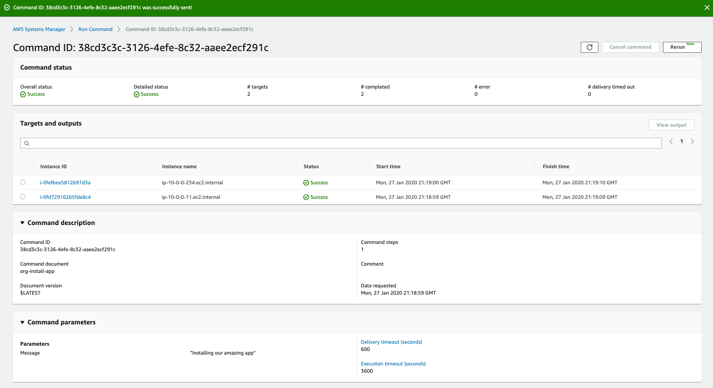

AWS Systems Manager Run Command lets you remotely and securely manage the configuration of your managed instances. A managed instance is any EC2 instance, on-premises server or virtual machine (VM), or other cloud VM in your hybrid environment that has been configured for Systems Manager. Run Command enables you to automate common administrative tasks and perform ad hoc configuration changes at scale. You can use Run Command from the AWS console, the AWS Command Line Interface, AWS Tools for Windows PowerShell, or the AWS SDKs. Run Command is offered at no additional cost.

Administrators use Run Command to perform the following types of tasks on their managed instances: install or bootstrap applications, build a deployment pipeline, capture log files when an instance is terminated from an Auto Scaling group, and join instances to a Windows domain, to name a few.

In this lab we will execute our newly created document on our managed instances using Run command.

1. Open the AWS Systems Manager console at https://console.aws.amazon.com/systems-manager/.
1. In the navigation pane, choose **Run Command**.
1. Choose **Run command**.
1. Select inside the search box under **Command Document** to apply a filter.
    - Select ```Owner : Owned by me```.
    - Select the document ```org-install-app```.
1. For **Document version**, select **Latest version at runtime**.
1. In the **Commands parameters** section, leave the default value for our parameter **Message** as ```Prepping Web Instance```.
1. In the **Targets** section, we will select a **Resource Group** by performing the following steps:
    - Select **Choose a resource group**.
    - For **Resource group**, choose the ```Web``` resource group we created earlier in Resource Groups + Tags section.
    - For **Resource types -*optional***, leave the default value of ```All available resource types```.
1. Leave other parameters and Rate Control options as default.
1.  Uncheck **Enable writing to an S3 bucket**.
1.  Select **Run**.
1. Select the refresh icon until **Status** changes to **Success**
1. You will be brought over to the Command Status of the Run Command invocation you initiated.
    
1. Select the radio button next to one the instance IDs chose **View Output** 
    - This will drill down into the details about the invocation of the **Run Command** operation and to review the output returned by stdout.
    - Expand **Step 1 -- Output**
        - **Important**: The command output displays a maximum of 2500 characters. You can view the complete command output in either Amazon S3 or CloudWatch logs, if you specify an S3 bucket or a CloudWatch logs group when you run the command.
1. We will now use Session Manager to connect to our managed instance and confirm that our Run Command was successful.