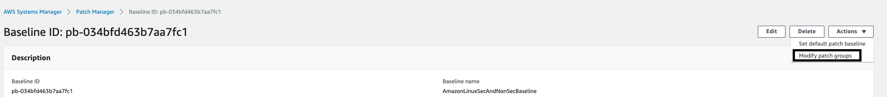

Patch Manager uses **patch baselines**, which include rules for
auto-approving patches within days of their release, as well as a list
of approved and rejected patches. Later in this lab we will schedule
patching to occur on a regular basis using a **Systems
Manager** **Maintenance Window** task. Patch Manager integrates with AWS
Identity and Access Management (IAM), AWS CloudTrail, and Amazon
CloudWatch Events to provide a secure patching experience that includes
event notifications and the ability to audit usage.

**Warning** \* **AWS does not test patches for Windows or Linux before
making them available in Patch Manager** . \* **If any updates are
installed by Patch Manager the patched instance is rebooted**.
\* **Always test patches thoroughly before deploying to production
environments. This is a customer owned responsibility.**

In this lab we will create Patch Baselines and Patch Groups. These
will be used to decide which patches to apply to our instances and which
instances to target.

### High-level Objectives

*   Create a custom patch baseline

*   Create a patch group to associate with the custom patch baseline

### Create Patch Baseline

1.  Under **Instances and Nodes** in the **AWS Systems
    Manager** navigation bar, select **Patch Manager**.

1.  Select the **View predefined patch baselines** link under
    the **Configure patching** button on the upper right.

1.  Select **Create patch baseline**.

1.  On the **Create patch baseline** page in the **Provide patch
    baseline details** section:
    -  Enter a **Name** for your custom patch baseline, such as ```AmazonLinuxSecAndNonSecBaseline```.
    - Optionally enter a description, such as Amazon Linux patch baseline including security and non-security patches.
    - Select **Amazon Linux 2** from the list.

1.  In the **Approval rules** section:
    - Examine the options in the lists and ensure that **Product**, **Classification**, and **Severity** have values of **All**.
    - Leave the **Auto approval delay** at its default of **0 days**.
    - Change the value of **Compliance reporting - optional** to **Critical**.
    - Select **Add another rule**.
    - In the new rule, change the value of **Compliance reporting - optional** to **Medium**.
    - Check the box under **Include non-security updates** to include all Amazon Linux 2 updates when patching.

If an approved patch is reported as missing, the option you select
in **Compliance reporting**, such as Critical or Medium, determines the
severity of the compliance violation reported in System
Manager **Compliance**.

1.  In the **Patch exceptions** section in the **Rejected patches - optional** text box, enter **system-release.\** 
    - This will [reject
        patches](https://docs.aws.amazon.com/systems-manager/latest/userguide/patch-manager-approved-rejected-package-name-formats.html) to
        new Amazon Linux releases that may advance you beyond the [Patch
        Manager supported operating
        systems](https://docs.aws.amazon.com/systems-manager/latest/userguide/patch-manager-supported-oses.html) prior
        to your testing new releases.

1.  For Linux operating systems, you can optionally define
    an [alternative patch source
    repository](https://docs.aws.amazon.com/systems-manager/latest/userguide/patch-manager-how-it-works-alt-source-repository.html).
    Select the **X** in the **Patch sources** area to remove the empty
    patch source definition.

1.  Select **Create patch baseline** and you will go to the **Patch
    Baselines** page where the AWS provided default patch baselines, and
    your custom baseline, are displayed.

### Create and Assign a Patch Group

A [patch
group](https://docs.aws.amazon.com/systems-manager/latest/userguide/sysman-patch-patchgroups.html) is
an optional method to organize instances for patching. For example, you
can create patch groups for different operating systems (Linux or
Windows), different environments (Development, Test, and Production), or
different server functions (web servers, file servers, databases). Patch
groups can help you avoid deploying patches to the wrong set of
instances. They can also help you avoid deploying patches before they
have been adequately tested.

You create a patch group by using Amazon EC2 tags. Unlike other tagging
scenarios across Systems Manager, a patch group must be defined with the
tag key: **Patch Group** (tag keys are case sensitive). You can specify
any value (for example, web servers) but the key must be Patch Group.
**Note**: An instance can only be in one patch group.

1.  Navigate to the [EC2 Console](https://console.aws.amazon.com/ec2)

1.  Go to **tags** on the left navigation panel.

1.  Select **Manage Tags**

1.  Select instances with Name App1 and App2

1.  Add Tag

1.  **Key:** Patch Group

1.  **Value:** App

1.  Select instances with Name Web1 and Web2

1.  Add Tag

1. **Key:** Patch Group

1. **Value:** Web

1. Navigate back to [Systems Manager \> Patch Manager \> Patch
    Baselines](https://console.aws.amazon.com/systems-manager/patch-manager/baselines)

1. Select the Baseline you created in the previous part
    (AmazonLinuxSecAndNonSecBaseline)

1. Go to Actions and Modify Patch
    Group

1. Type in App and Add the Patch Group to the Baseline

From here you could utilize **AWS-RunPatchBaseline** pre-defined
document to scan or patch your instances. Instead we are going to chain
the capabilities together and utilize a Maintenance Window to execute
the Run command and document mentioned above.

**NOTE:** You can also Select Configure Patching and link the Patch
Baseline to the Maintenance Window, it will register the run task with
the maintenance window and also register the Patch Group as targets. It
utilizes the existing role AWSServiceRoleforAmazonSSM.
